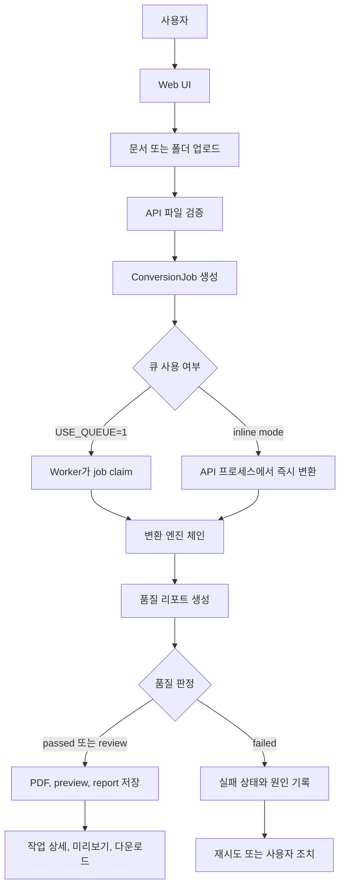
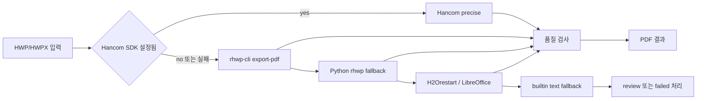
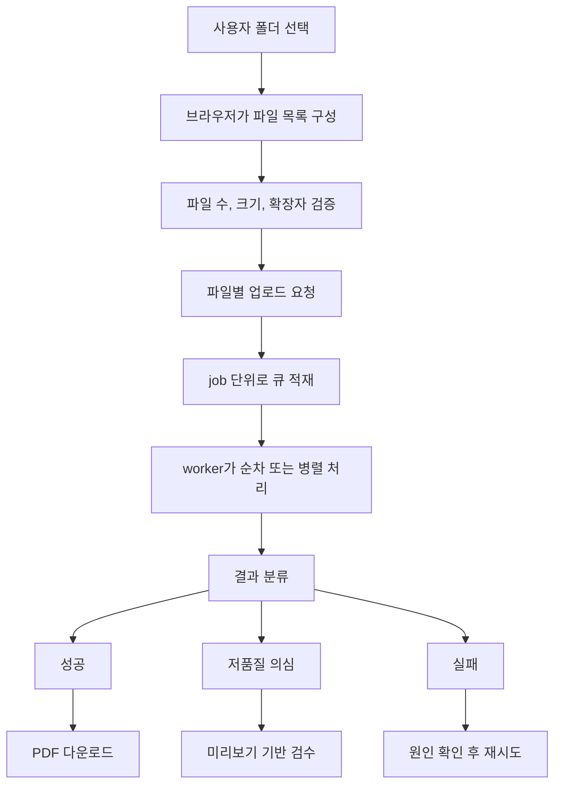
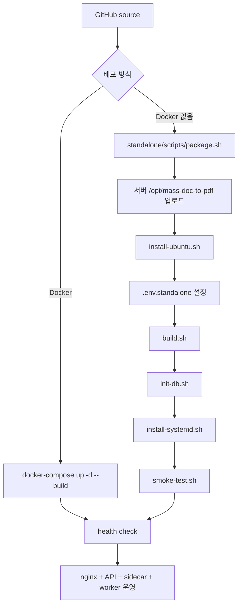

# Mass Doc to PDF

HWP, HWPX, Word, PowerPoint, Excel 문서를 PDF로 변환하는 대용량 문서 변환 서비스입니다.
단일 파일 변환뿐 아니라 폴더 단위 일괄 업로드, 작업 큐, 변환 품질 리포트, PDF 미리보기, 실패/재시도 분리를 목표로 합니다.

## 서비스 개요

이 서비스는 사용자가 업로드한 문서를 변환 엔진 체인에 태우고, 결과 PDF와 품질 판단 정보를 함께 제공합니다.
사용자는 단순히 "변환 성공" 여부만 보는 것이 아니라 어떤 엔진으로 변환되었는지, 결과가 검토 대상인지, 미리보기로 확인할 수 있는지까지 확인할 수 있습니다.

핵심 기능:

- 문서 업로드: HWP/HWPX, DOC/DOCX, PPT/PPTX, XLS/XLSX
- PDF 변환: rhwp-cli, Python rhwp, H2Orestart/LibreOffice, builtin fallback, 선택형 상용 엔진
- 작업 큐: pending, running, success, failed 상태 추적
- 대량 처리: 폴더 내 다수 파일 업로드와 작업별 결과 분리
- 품질 리포트: 엔진명, 품질 등급, 경고, PDF 크기, 페이지/미리보기 정보
- PDF 확인: 다운로드, 브라우저 미리보기, PNG 미리보기 fallback
- 배포 방식: Docker 기반 개발/운영, Docker 없는 Ubuntu systemd/nginx 단독 배포

## 목적

문서 변환 서비스에서 가장 큰 문제는 "성공으로 표시됐지만 PDF가 원본과 다름"입니다.
이 프로젝트는 변환 결과를 운영자가 판단할 수 있도록 성공, 실패, 저품질 의심, 재시도 대상을 분리하는 것을 목적으로 합니다.

운영 목적:

- HWP/HWPX 문서의 변환 성공률과 렌더링 품질을 지속 측정
- 1,000개 수준의 대량 변환에서도 전체 작업이 중단되지 않도록 job 단위로 격리
- 이미지, 표, 폰트, 페이지네이션 문제를 품질 리포트와 미리보기로 조기 발견
- Docker 없는 서버에도 소스 기반으로 배포할 수 있는 독립 운영 패키지 제공
- 향후 Hancom SDK 같은 정밀 엔진을 붙일 수 있는 엔진 레지스트리 구조 유지

## 활용 범위

| 영역 | 포함 범위 |
|---|---|
| 입력 문서 | HWP, HWPX, DOC, DOCX, PPT, PPTX, XLS, XLSX |
| 출력 | PDF, PDF 다운로드, PDF inline preview, PNG preview |
| 사용자 흐름 | 로그인, 단일 업로드, 폴더 일괄 업로드, 작업 큐 확인, 상세 결과 확인 |
| 운영 흐름 | API health, sidecar health, worker, quality report, smoke test |
| 배포 | Docker compose, GitHub Actions, Docker 없는 `standalone/` 배포 |
| 품질 관리 | 엔진명 기록, 품질 등급, 경고, 실패 원인, 코퍼스 리포트 |

현재 범위 밖이거나 별도 검증이 필요한 항목:

- 모든 HWP 문서의 100% 원본 동일 렌더링 보장
- Google OAuth 외부 운영 로그인 자동 구성
- 상용 Hancom SDK/Aspose 라이선스 자동 제공
- 50/100/1,000개 실제 고객 문서 코퍼스의 완전한 품질 보증
- 암호 문서, 손상 문서, 매우 오래된 HWP 버전의 완전 지원

## 전체 서비스 흐름



## 변환 엔진 Workflow

HWP/HWPX는 문서 구조와 렌더링 품질 편차가 커서 하나의 엔진만 사용하지 않습니다.
정밀 엔진부터 fallback까지 순서대로 시도하고, 결과를 품질 리포트에 남깁니다.



Office 계열 문서는 LibreOffice 기반 변환을 기본으로 사용하고, 설정된 경우 Aspose 같은 상용 엔진을 우선 사용할 수 있습니다.

## 1,000개 대량 변환 흐름



대량 변환에서는 한 파일의 실패가 전체 batch를 멈추지 않는 것이 중요합니다.
그래서 결과 화면은 성공, 실패, 저품질 의심, 재시도 가능 항목을 분리해서 보여주는 방향으로 설계되어 있습니다.

## 배포 Workflow



Docker 없이 운영하는 서버는 [`standalone/`](standalone/) 폴더가 기준입니다.
상세 절차는 [`standalone/README.md`](standalone/README.md), 운영 검증 항목은 [`standalone/OPERATIONS-VALIDATION.md`](standalone/OPERATIONS-VALIDATION.md)를 확인하세요.

## 구성

```text
apps/web          React + Vite 대시보드 SPA
apps/api          Fastify API, 인증, 변환 라우팅, 작업 큐, 품질 리포트
packages/shared   web/api 공용 DTO 타입
hwp-sidecar       LibreOffice + H2Orestart 변환 sidecar
standalone        Docker 없는 Ubuntu systemd/nginx 배포 패키지
e2e               Playwright 기반 브라우저 검증
```

## 빠른 실행

개발 환경에서 전체 스택을 가장 빠르게 실행하는 방법입니다.

```bash
git clone https://github.com/younghai/mass-doc-to-pdf.git
cd mass-doc-to-pdf
cp .env.example .env
```

`.env`에서 `AUTH_SECRET`을 채웁니다.

```bash
openssl rand -base64 32
```

Docker 기반 실행:

```bash
docker-compose up -d --build
curl http://localhost:8010/health
open http://localhost:8081
```

기본값은 `DEV_AUTH=1`이라 Google OAuth 없이 로컬 운영자 계정으로 UI를 확인할 수 있습니다.

Docker 없는 서버 배포:

```bash
standalone/scripts/package.sh

cd /opt/mass-doc-to-pdf
sudo standalone/scripts/install-ubuntu.sh
cp standalone/env.example .env.standalone
standalone/scripts/build.sh
standalone/scripts/init-db.sh
sudo standalone/scripts/install-systemd.sh
standalone/scripts/smoke-test.sh
```

단독 운영 기본 포트:

| 구성요소 | 기본값 |
|---|---|
| Web/Nginx | `80` |
| API | `127.0.0.1:18010` |
| sidecar | `127.0.0.1:18080` |
| DB | `./data/app.db` |
| 파일 저장소 | `./data/objects` |

## 화면과 사용 방법

| 화면 | 목적 |
|---|---|
| `/service/upload` | 단일 문서 업로드와 즉시 변환 결과 확인 |
| `/service/batch` | 폴더 또는 다수 파일 일괄 변환 |
| `/service/jobs` | 작업 큐, 성공/실패/진행 상태 확인 |
| job detail | 엔진명, 품질 등급, 경고, 미리보기, 다운로드 확인 |
| dashboard | 변환 성공률과 상태별 작업 집계 |

기본 사용 순서:

1. 서비스 접속 후 로그인합니다. 개발/내부 운영은 `DEV_AUTH=1`로 바로 진입할 수 있습니다.
2. `문서 업로드` 또는 `폴더 일괄 변환`에서 파일을 선택합니다.
3. 작업 큐에서 변환 상태를 확인합니다.
4. 변환 완료 후 PDF 미리보기 또는 PNG 미리보기로 결과를 확인합니다.
5. 품질 등급이 `review`이거나 경고가 있으면 원본 대비 검수 후 재시도 또는 정밀 엔진 적용을 판단합니다.

## API 계약

| 메서드 및 경로 | 설명 |
|---|---|
| `POST /api/convert` | 멀티파트 `file` 업로드 후 변환 작업 생성 |
| `GET /api/jobs` | 내 변환 작업 목록 |
| `GET /api/jobs?status=pending` | 상태별 작업 필터 |
| `GET /api/jobs/:id` | 작업 상세 |
| `GET /api/jobs/:id/download` | 결과 PDF 다운로드 |
| `GET /api/jobs/:id/preview` | PDF inline preview |
| `GET /api/jobs/:id/preview.png` | PNG preview fallback |
| `GET /api/jobs/:id/quality` | 품질 리포트 |
| `GET /api/stats` | 전체 작업 통계 |
| `GET /health` | API health check |

## 품질 상태 모델

| 상태 | 의미 | 운영 조치 |
|---|---|---|
| `passed` | 자동 검사 기준 통과 | 다운로드 또는 사용자 전달 가능 |
| `review` | 변환은 됐지만 품질 의심 | 미리보기 확인, 원본 비교, 필요 시 정밀 엔진 재시도 |
| `failed` | 변환 실패 | 실패 원인 확인 후 재시도 또는 파일 조치 |

품질 리포트는 다음 정보를 중심으로 확인합니다.

- 선택된 변환 엔진
- PDF 생성 여부와 파일 크기
- preview 생성 여부
- 변환 경고와 실패 원인
- batch 내 성공/실패/review 분포
- HWP/HWPX 코퍼스 리포트의 엔진별 성공률

## 테스트와 검증

```bash
pnpm -r test
pnpm -r typecheck
pnpm -r build
```

standalone 운영 패키지는 다음 스크립트로 검증합니다.

```bash
bash -n standalone/scripts/*.sh
standalone/scripts/smoke-test.sh
standalone/scripts/quality-report-summary.sh <report-dir>
```

브라우저 기반 검증이 필요할 때는 e2e 스택을 띄운 뒤 Playwright를 실행합니다.

```bash
docker-compose up -d --build
cd e2e
pnpm install --ignore-workspace
RUN_E2E=1 pnpm test
```

## 운영상 주의사항

- HWP/HWPX는 문서 버전, 폰트, 표, 이미지, 각주, 머리말/꼬리말에 따라 렌더링 편차가 생길 수 있습니다.
- builtin fallback은 텍스트 추출 중심이므로 원본 서식을 보존해야 하는 문서에는 `review` 또는 실패로 취급하는 것이 안전합니다.
- 외부 사용자용 Google OAuth는 `DEV_AUTH=0`, DNS 도메인, HTTPS, Google Cloud Console redirect URI 등록이 필요합니다.
- 대량 batch 운영 전에는 실제 HWP/HWPX 샘플 50개 또는 100개 이상으로 품질 코퍼스 리포트를 먼저 생성해야 합니다.
- 운영 DB migration과 production DB 명령은 별도 승인과 rollback 계획 없이 자동 실행하지 않습니다.

## 향후 고도화

- rhwp-cli raster 모드: 이미지 PDF 기반 시각 보존 fallback
- Hancom SDK 정밀 변환 플랜: 공공기관/기업용 고충실도 옵션
- 1,000개 batch 리포트: 성공, 실패, review, 재시도 가능률 집계
- 원본 대비 자동 품질 지표: 페이지 수, 텍스트 추출 일치율, 이미지/표 보존율
- 운영 UI 고도화: 담당자, 상태, 재시도, 검수 메모, 증거 링크를 포함한 작업 큐
