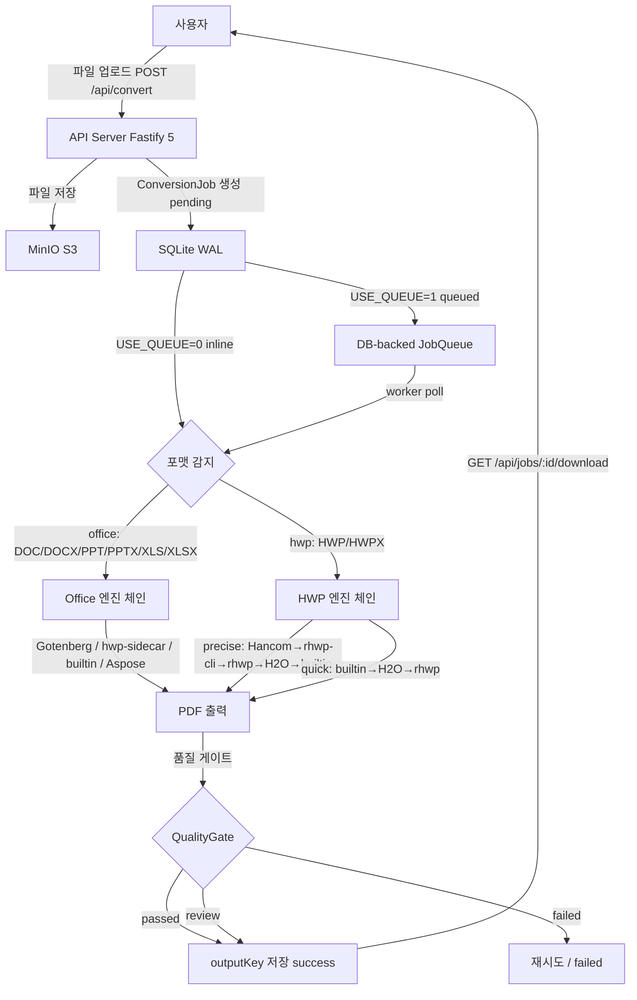

# 서비스 기획서 (Service Planning Document)

> Mass Doc to PDF (mass-doc-to-pdf)의 대용량 문서 변환 서비스 기획서. HWP/HWPX/DOC/DOCX/PPT/PPTX/XLS/XLSX 파일을 PDF로 변환하며 품질 리포트·엔진 체인·durable queue로 운영 가시성을 제공한다.

| 항목 | 내용 |
| --- | --- |
| **프로젝트명** | Mass Doc to PDF (mass-doc-to-pdf) |
| **문서 버전** | v1.0 |
| **작성일** | 2026-06-11 |
| **최종 수정일** | 2026-06-11 |
| **작성자** | 개발팀 |
| **문서 상태** | 작성 중 |

---

## 1. 서비스 개요

### 1.1 서비스명 및 컨셉

| 항목 | 내용 |
| --- | --- |
| 서비스명 | Mass Doc to PDF |
| 한 줄 설명 | HWP/HWPX/DOC/DOCX/PPT/PPTX/XLS/XLSX 문서를 PDF로 변환하는 대용량 문서 변환 서비스. 엔진 체인·품질 리포트·durable queue로 운영 가시성을 제공한다. |
| 서비스 유형 | Document Conversion Platform |
| 대상 플랫폼 | Web Browser (Desktop), REST API |

**배경 및 동기:**

- 공공기관·기업 환경에서 HWP 포맷이 광범위하게 사용되나 표준 PDF 변환 도구가 부재
- 단일 변환 엔진의 신뢰성 한계 → 엔진 체인(Hancom SDK → rhwp-cli → H2Orestart → builtin fallback)으로 안정성 확보
- 대량 문서 변환 시 진행 상황 파악 불가 → DB-backed durable queue로 운영 가시성 제공
- 변환 결과 품질 검증 없이 운영 → 품질 게이트·품질 리포트로 렌더링 품질 보증

### 1.2 핵심 가치 제안

| 항목 | 내용 |
| --- | --- |
| 핵심 가치 | 복수 엔진 체인으로 HWP 변환 성공률 극대화, 품질 리포트로 렌더링 신뢰도 보증 |
| 차별점 | precise/quick 두 가지 변환 모드, 엔진 체인 fallback, 품질 게이트(passed/review/failed) |
| 운영 가시성 | durable queue + worker 분리, 상태 전이 추적, 재시도 메커니즘 내장 |

### 1.3 타겟 사용자

| 사용자 | 설명 |
| --- | --- |
| 공공기관 담당자 | 대량 HWP 공문서를 PDF로 일괄 변환하여 아카이빙·배포 |
| 기업 운영팀 | DOC/XLS/PPT 등 사무 문서를 PDF로 표준화하여 공유·보관 |
| 개발자/운영자 | REST API 또는 BatchUpload UI를 통해 자동화 파이프라인에 통합, 변환 품질 모니터링 |

---

## 2. 핵심 메커니즘

### 2.1 업로드→변환 흐름

### 2.2 핵심 기술 스택

| 영역 | 기술 | 역할 |
| --- | --- | --- |
| API 서버 | Fastify 5 + Node.js | REST API, 파일 업로드, 작업 관리 |
| ORM / DB | Prisma 6 + SQLite WAL | ConversionJob 영속화, busy_timeout=5000 |
| 프론트엔드 | React + Vite + TanStack Query | 업로드·작업 목록·통계 UI |
| 스토리지 | MinIO (S3 호환) | 원본 파일(sourceKey), PDF 출력(outputKey) |
| 인증 | Auth.js v5 (Google OAuth) | 사용자 인증, DEV_AUTH=1 개발 모드 |
| 큐 | DB-backed JobQueue + worker | USE_QUEUE=1 시 별도 worker 프로세스 |
| HWP 변환 | Hancom SDK / rhwp-cli / H2Orestart / LibreOffice sidecar | HWP/HWPX → PDF |
| Office 변환 | Gotenberg / hwp-sidecar / builtin / Aspose | DOC/PPT/XLS → PDF |
| 컨테이너 | Docker Compose | 전체 인프라 오케스트레이션 |
| 보안 | rate-limit, CSRF Origin check, Secure 쿠키, trustProxy | 인증·속도 제한·CSRF 방어 |

---

## 3. MVP 스코프

### In-Scope

- [x] 단건 문서 업로드 및 PDF 변환 (POST /api/convert)
- [x] 폴더/다수 파일 일괄 변환 (BatchUpload)
- [x] HWP/HWPX 엔진 체인 (precise/quick 모드)
- [x] Office 포맷 엔진 체인 (DOC/DOCX/PPT/PPTX/XLS/XLSX)
- [x] DB-backed durable queue (USE_QUEUE=1)
- [x] 작업 상태 조회 및 필터 (Jobs 화면)
- [x] 변환 결과 상세 + 품질 리포트 (JobDetail)
- [x] PDF 다운로드 및 인라인 미리보기
- [x] PNG 미리보기 (LibreOffice 렌더)
- [x] 실패 작업 재시도 (POST /api/jobs/:id/retry)
- [x] 작업 삭제 + MinIO 파일 삭제 (DELETE /api/jobs/:id)
- [x] 대시보드 통계 (GET /api/stats)
- [x] Auth.js v5 Google OAuth 인증
- [x] rate-limit, CSRF, Secure 쿠키 보안 강화
- [x] 헬스체크 (GET /health)

### Out-of-Scope

- [ ] 다국어(i18n) 지원
- [ ] 이메일 알림 (변환 완료 시)
- [ ] 사용자별 API 키 발급 (외부 API 연동)
- [ ] 변환 결과 버전 관리
- [ ] 멀티 테넌트 / 조직 단위 분리
- [ ] 결제 / 사용량 과금

---

## 4. KPI 가설 검증 프레임워크

| KPI | 측정 방법 | 목표치 | 검증 주기 |
| --- | --- | --- | --- |
| 변환 성공률 | status=success 건수 / 전체 완료 건수 | ≥ 95% | 주간 |
| 렌더링 품질 review 비율 | qualityStatus=review 건수 / 전체 성공 건수 | ≤ 10% | 주간 |
| P99 변환 시간 | durationMs 99번째 백분위 (HWP precise) | ≤ 60초 | 주간 |
| P99 변환 시간 | durationMs 99번째 백분위 (Office) | ≤ 30초 | 주간 |
| 시스템 가용성 | GET /health uptime | ≥ 99.5% | 일간 |
| 재시도 성공률 | 재시도 후 success 건수 / 전체 재시도 건수 | ≥ 60% | 월간 |

---

## 5. 관련 문서

| 문서명 | 위치 |
| --- | --- |
| 비즈니스 정책서 | `docs/waterfall/00-planning/business-policy.md` |
| 요구사항 명세서(SRS) | `docs/waterfall/01-requirements/01-requirements.md` |
| 유스케이스 명세서 | `docs/waterfall/01-requirements/use-case.md` |
| 요구사항 추적 매트릭스(RTM) | `docs/waterfall/01-requirements/rtm.md` |
| 용어 규칙 | `docs/waterfall/01-requirements/terminology.md` |
| 시스템 아키텍처 | `docs/waterfall/02-system-design/system-architecture-design.md` |
| API 설계서 | `docs/waterfall/02-system-design/api-design.md` |
| DB 설계서 | `docs/waterfall/02-system-design/database-design.md` |

---

## 6. 변경 이력

| 버전 | 날짜 | 작성자 | 변경 내용 |
| --- | --- | --- | --- |
| v1.0 | 2026-06-11 | 개발팀 | 초안 작성 |
