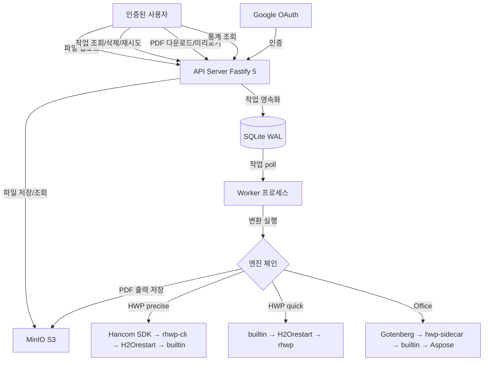

# 유스케이스 명세서 (Use Case Specification)

> Mass Doc to PDF (mass-doc-to-pdf)의 주요 유스케이스별 흐름 및 예외 처리를 정의한다.

| 항목 | 내용 |
| --- | --- |
| **프로젝트명** | Mass Doc to PDF (mass-doc-to-pdf) |
| **문서 버전** | v1.0 |
| **작성일** | 2026-06-11 |
| **최종 수정일** | 2026-06-11 |
| **작성자** | 개발팀 |
| **문서 상태** | 작성 중 |

---

## 1. 유스케이스 목록

| UC ID | 유스케이스명 | 주요 액터 | 우선순위 |
| --- | --- | --- | --- |
| UC-01 | 단건 문서 변환 | 인증된 사용자 | 필수 |
| UC-02 | 폴더 일괄 변환 (BatchUpload) | 인증된 사용자 | 필수 |
| UC-03 | 작업 큐 확인 및 필터 | 인증된 사용자 | 필수 |
| UC-04 | 변환 결과 상세 확인 | 인증된 사용자 | 필수 |
| UC-05 | PDF 다운로드 및 인라인 미리보기 | 인증된 사용자 | 필수 |
| UC-06 | PNG 미리보기 | 인증된 사용자 | 선택 |
| UC-07 | 품질 리포트 확인 | 인증된 사용자 | 필수 |
| UC-08 | 실패 작업 재시도 | 인증된 사용자 | 필수 |
| UC-09 | 작업 삭제 | 인증된 사용자 | 필수 |
| UC-10 | 대시보드 통계 확인 | 인증된 사용자, 운영자 | 필수 |

---

## 2. 시스템 컨텍스트 다이어그램

---

## 3. 유스케이스 상세

### UC-01: 단건 문서 변환

| 항목 | 내용 |
| --- | --- |
| UC ID | UC-01 |
| 유스케이스명 | 단건 문서 변환 |
| 액터 | 인증된 사용자 |
| 선행 조건 | 사용자가 Auth.js 세션으로 인증된 상태 |
| 후행 조건 | ConversionJob이 생성되고 변환이 완료되면 PDF를 다운로드할 수 있다 |

**기본 흐름:**

1. 사용자가 Upload 화면에서 파일을 선택한다 (HWP/HWPX/DOC/DOCX/PPT/PPTX/XLS/XLSX).
2. 사용자가 qualityMode(precise/quick)를 선택한다 (기본값: quick).
3. 사용자가 변환 버튼을 클릭한다.
4. 클라이언트가 `POST /api/convert`에 multipart/form-data로 파일을 전송한다.
5. API 서버가 파일 크기(≤20MB) 및 포맷을 검증한다.
6. API 서버가 파일을 MinIO에 저장하고 sourceKey를 확보한다.
7. API 서버가 ConversionJob을 생성한다 (status=pending).
8. `USE_QUEUE=0`이면 인라인으로 즉시 엔진 체인을 실행하여 PDF를 생성한다.
9. 변환 완료 후 품질 게이트를 실행하고 outputKey를 저장한다 (status=success).
10. API 서버가 작업 ID와 status를 응답한다.
11. 사용자가 JobDetail 화면으로 이동하여 결과를 확인한다.

**예외 흐름:**

| 예외 | 처리 |
| --- | --- |
| 파일 크기 20MB 초과 | 413 응답, 업로드 중단 |
| 지원하지 않는 포맷 | 400 응답 |
| 미인증 요청 | 401 응답, 로그인 페이지로 리다이렉트 |
| rate limit 초과 | 429 응답 + Retry-After 헤더 |
| 모든 엔진 변환 실패 | status=failed, error 필드에 실패 원인 기록 |

---

### UC-02: 폴더 일괄 변환 (BatchUpload)

| 항목 | 내용 |
| --- | --- |
| UC ID | UC-02 |
| 유스케이스명 | 폴더 일괄 변환 |
| 액터 | 인증된 사용자 |
| 선행 조건 | 사용자가 인증된 상태, 변환할 파일이 1개 이상 |
| 후행 조건 | 각 파일마다 독립적인 ConversionJob이 생성되고 동일한 batchId로 묶인다 |

**기본 흐름:**

1. 사용자가 BatchUpload 화면으로 이동한다.
2. 사용자가 폴더 또는 다수 파일을 드래그&드롭 또는 파일 선택기로 선택한다.
3. 화면에 선택된 파일 목록과 포맷 분류가 표시된다.
4. 사용자가 qualityMode를 선택하고 일괄 변환 시작 버튼을 클릭한다.
5. 클라이언트가 파일별로 `POST /api/convert`를 순차/병렬 호출한다 (공통 batchId 포함).
6. 각 파일에 대해 UC-01의 기본 흐름 3~9단계가 실행된다.
7. 배치 내 모든 작업의 진행 상황이 BatchUpload 화면에 실시간으로 표시된다.
8. 완료된 작업은 즉시 다운로드 버튼이 활성화된다.

**예외 흐름:**

| 예외 | 처리 |
| --- | --- |
| 일부 파일 포맷 미지원 | 해당 파일만 건너뛰고 목록에 경고 표시, 나머지는 정상 처리 |
| 배치 중 일부 작업 실패 | 해당 작업만 failed로 표시, 나머지 진행 계속 |
| 사용자당 활성 작업 50개 초과 | 429 응답, 배치 업로드 중단 |

---

### UC-03: 작업 큐 확인 및 필터

| 항목 | 내용 |
| --- | --- |
| UC ID | UC-03 |
| 유스케이스명 | 작업 큐 확인 및 필터 |
| 액터 | 인증된 사용자 |
| 선행 조건 | 사용자가 인증된 상태, ConversionJob이 1개 이상 존재 |
| 후행 조건 | 사용자가 원하는 상태의 작업 목록을 확인한다 |

**기본 흐름:**

1. 사용자가 Jobs 화면으로 이동한다.
2. 클라이언트가 `GET /api/jobs`를 호출하여 작업 목록을 가져온다.
3. 작업 목록이 생성일 내림차순으로 표시된다 (filename, format, status, engine, durationMs, createdAt).
4. 사용자가 상태 필터(pending/queued/running/success/failed)를 선택한다.
5. 클라이언트가 `GET /api/jobs?status=<value>`를 재호출하여 필터링된 목록을 표시한다.
6. 사용자가 특정 작업 행을 클릭하여 JobDetail 화면으로 이동한다.

**예외 흐름:**

| 예외 | 처리 |
| --- | --- |
| 작업 없음 | 빈 목록과 안내 메시지 표시 |
| 미인증 요청 | 401 응답 |

---

### UC-04: 변환 결과 상세 확인

| 항목 | 내용 |
| --- | --- |
| UC ID | UC-04 |
| 유스케이스명 | 변환 결과 상세 확인 |
| 액터 | 인증된 사용자 |
| 선행 조건 | 사용자가 인증된 상태, 조회할 ConversionJob이 존재 |
| 후행 조건 | 사용자가 작업의 상세 정보(엔진, 품질, 오류 등)를 확인한다 |

**기본 흐름:**

1. 사용자가 Jobs 목록에서 특정 작업을 클릭하거나 직접 URL로 접근한다.
2. 클라이언트가 `GET /api/jobs/:id`를 호출한다.
3. 화면에 다음 정보가 표시된다: filename, format, extension, status, engine, qualityMode, durationMs, error, createdAt.
4. status=success인 경우 PDF 미리보기 iframe과 다운로드 버튼이 표시된다.
5. qualityStatus=review인 경우 주의 배지와 수동 검토 안내 메시지가 표시된다.
6. status=failed인 경우 error 메시지와 재시도 버튼이 표시된다.

**예외 흐름:**

| 예외 | 처리 |
| --- | --- |
| 존재하지 않는 작업 ID | 404 응답 |
| 다른 사용자의 작업 접근 | 403 응답 |

---

### UC-05: PDF 다운로드 및 인라인 미리보기

| 항목 | 내용 |
| --- | --- |
| UC ID | UC-05 |
| 유스케이스명 | PDF 다운로드 및 인라인 미리보기 |
| 액터 | 인증된 사용자 |
| 선행 조건 | ConversionJob의 status=success이고 outputKey가 존재 |
| 후행 조건 | 사용자가 PDF 파일을 다운로드하거나 브라우저에서 인라인으로 확인한다 |

**기본 흐름 (다운로드):**

1. 사용자가 JobDetail 화면에서 다운로드 버튼을 클릭한다.
2. 클라이언트가 `GET /api/jobs/:id/download`를 호출한다.
3. API 서버가 MinIO에서 outputKey에 해당하는 PDF 스트림을 가져온다.
4. `Content-Disposition: attachment; filename="<filename>.pdf"` 헤더와 함께 PDF를 전송한다.
5. 브라우저가 파일을 다운로드한다.

**기본 흐름 (인라인 미리보기):**

1. JobDetail 화면의 미리보기 iframe이 `GET /api/jobs/:id/preview`를 로드한다.
2. API 서버가 `Content-Disposition: inline` 헤더와 함께 PDF를 스트리밍한다.
3. 브라우저 내장 PDF 뷰어에서 PDF가 렌더링된다.

**예외 흐름:**

| 예외 | 처리 |
| --- | --- |
| status가 success가 아닌 작업 | 404 응답 (outputKey 없음) |
| MinIO에서 파일 조회 실패 | 502 응답 |

---

### UC-06: PNG 미리보기

| 항목 | 내용 |
| --- | --- |
| UC ID | UC-06 |
| 유스케이스명 | PNG 미리보기 |
| 액터 | 인증된 사용자 |
| 선행 조건 | ConversionJob의 status=success이고 hwp-sidecar에 LibreOffice가 설치됨 |
| 후행 조건 | 사용자가 PDF 첫 페이지의 PNG 이미지를 확인한다 |

**기본 흐름:**

1. 사용자가 JobDetail 화면에서 PNG 미리보기를 요청한다.
2. 클라이언트가 `GET /api/jobs/:id/preview.png`를 호출한다.
3. API 서버가 outputKey의 PDF를 MinIO에서 가져온다.
4. hwp-sidecar의 LibreOffice를 통해 PDF 첫 페이지를 PNG로 렌더링한다.
5. PNG 이미지를 `Content-Type: image/png`로 반환한다.

**예외 흐름:**

| 예외 | 처리 |
| --- | --- |
| LibreOffice 미설치 | 501 응답 또는 feature disabled 메시지 |
| PDF 렌더링 실패 | 502 응답 |

---

### UC-07: 품질 리포트 확인

| 항목 | 내용 |
| --- | --- |
| UC ID | UC-07 |
| 유스케이스명 | 품질 리포트 확인 |
| 액터 | 인증된 사용자 |
| 선행 조건 | ConversionJob이 완료 상태(success/failed)이고 품질 리포트가 생성됨 |
| 후행 조건 | 사용자가 각 엔진의 시도 결과와 최종 품질 판정을 확인한다 |

**기본 흐름:**

1. 사용자가 JobDetail 화면에서 품질 리포트 탭을 클릭한다.
2. 클라이언트가 `GET /api/jobs/:id/quality`를 호출한다.
3. 화면에 다음 정보가 표시된다:
   - QualityStatus(passed/review/failed) — 전체 판정
   - QualityGrade(good/acceptable/fallback/failed) — 품질 등급
   - QualityAttempt 목록: 각 엔진명, 성공 여부, 소요 시간, 오류 메시지
4. QualityStatus=review인 경우 "PDF를 직접 확인하고 사용 여부를 판단하세요" 안내가 강조 표시된다.

**예외 흐름:**

| 예외 | 처리 |
| --- | --- |
| 품질 리포트 미생성 (pending/running 상태) | 202 응답 또는 "변환 진행 중" 메시지 |
| 작업 미존재 | 404 응답 |

---

### UC-08: 실패 작업 재시도

| 항목 | 내용 |
| --- | --- |
| UC ID | UC-08 |
| 유스케이스명 | 실패 작업 재시도 |
| 액터 | 인증된 사용자 |
| 선행 조건 | ConversionJob의 status=failed |
| 후행 조건 | ConversionJob의 status가 pending(또는 queued)으로 리셋되어 재변환이 실행된다 |

**기본 흐름:**

1. 사용자가 JobDetail 화면 또는 Jobs 목록에서 재시도 버튼을 클릭한다.
2. 클라이언트가 `POST /api/jobs/:id/retry`를 호출한다.
3. API 서버가 ConversionJob의 status를 pending으로 리셋하고 attempts를 초기화한다.
4. `USE_QUEUE=0`이면 즉시 재변환을 실행한다. `USE_QUEUE=1`이면 queued로 전환한다.
5. UI가 자동으로 새로고침되어 변환 진행 상태를 표시한다.

**예외 흐름:**

| 예외 | 처리 |
| --- | --- |
| status가 failed가 아닌 작업 | 400 응답 ("재시도할 수 없는 상태") |
| attempts가 최대값(3)에 도달한 경우 | 재시도 허용하되 운영자 검토 권장 메시지 표시 |

---

### UC-09: 작업 삭제

| 항목 | 내용 |
| --- | --- |
| UC ID | UC-09 |
| 유스케이스명 | 작업 삭제 |
| 액터 | 인증된 사용자 |
| 선행 조건 | 사용자가 소유한 ConversionJob이 존재 |
| 후행 조건 | ConversionJob 레코드와 MinIO의 원본 파일(sourceKey) 및 PDF(outputKey)가 모두 삭제된다 |

**기본 흐름:**

1. 사용자가 Jobs 목록 또는 JobDetail 화면에서 삭제 버튼을 클릭한다.
2. 확인 모달이 표시된다 ("파일과 변환 결과가 모두 삭제됩니다").
3. 사용자가 삭제를 확인한다.
4. 클라이언트가 `DELETE /api/jobs/:id`를 호출한다.
5. API 서버가 MinIO에서 sourceKey 파일을 삭제한다.
6. outputKey가 존재하면 MinIO에서 PDF 파일도 삭제한다.
7. SQLite에서 ConversionJob 레코드를 삭제한다.
8. 204 응답 반환 후 UI가 Jobs 목록으로 이동한다.

**예외 흐름:**

| 예외 | 처리 |
| --- | --- |
| 다른 사용자의 작업 삭제 시도 | 403 응답 |
| MinIO 파일 삭제 실패 | 경고 로그 기록, DB 레코드는 삭제 진행 |
| status=running인 작업 | 삭제 전 경고 표시 ("변환 중인 작업입니다") |

---

### UC-10: 대시보드 통계 확인

| 항목 | 내용 |
| --- | --- |
| UC ID | UC-10 |
| 유스케이스명 | 대시보드 통계 확인 |
| 액터 | 인증된 사용자, 운영자 |
| 선행 조건 | 사용자가 인증된 상태 |
| 후행 조건 | 사용자가 변환 현황과 품질 분포를 확인한다 |

**기본 흐름:**

1. 사용자가 Dashboard 화면으로 이동한다.
2. 클라이언트가 `GET /api/stats`를 호출한다.
3. 화면에 다음 통계가 표시된다:
   - 전체 작업 수 및 상태별 집계 (pending/queued/running/success/failed)
   - 포맷별 집계 (hwp/office)
   - 평균 변환 시간 (durationMs 평균)
   - 품질 등급 분포 (good/acceptable/fallback/failed 비율)
   - 엔진별 사용 횟수
4. 통계는 TanStack Query로 주기적으로 갱신된다 (refetchInterval).

**예외 흐름:**

| 예외 | 처리 |
| --- | --- |
| 데이터 없음 | 0 값과 빈 차트로 표시 |
| API 오류 | "통계를 불러올 수 없습니다" 안내 메시지 |

---

## 4. 변경 이력

| 버전 | 날짜 | 작성자 | 변경 내용 |
| --- | --- | --- | --- |
| v1.0 | 2026-06-11 | 개발팀 | 초안 작성 |
