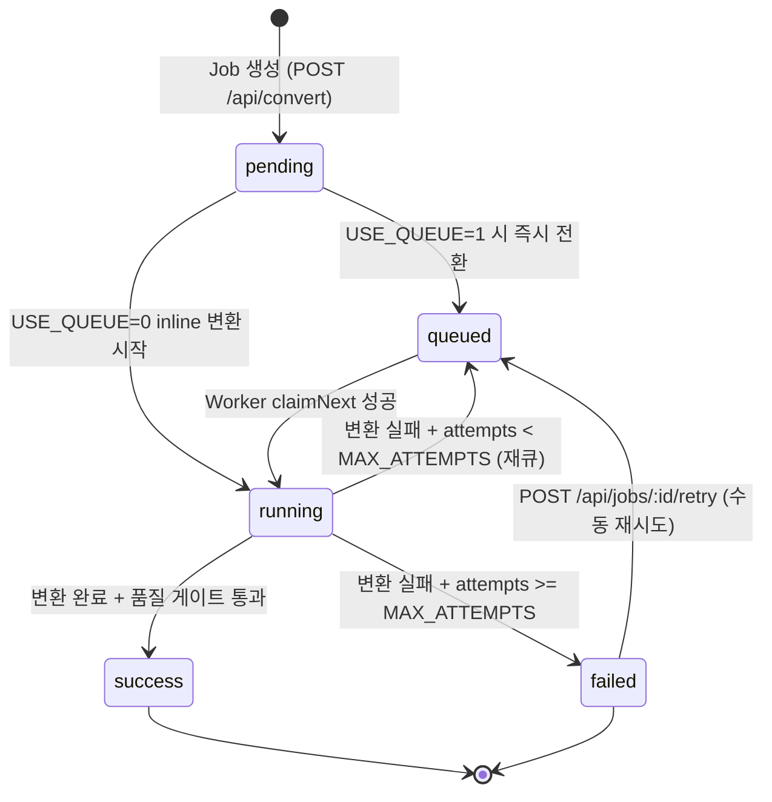
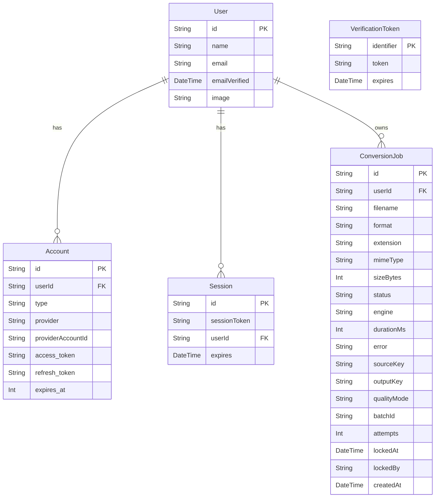

# DB 설계서 (Database Design)

> Mass Doc to PDF (mass-doc-to-pdf)의 데이터베이스 설계서. SQLite WAL 모드, Prisma ORM 스키마, 인덱스 전략, 상태 전이 규칙, 낙관적 잠금 패턴을 정의한다.

| 항목 | 내용 |
| --- | --- |
| **프로젝트명** | Mass Doc to PDF (mass-doc-to-pdf) |
| **문서 버전** | v1.0 |
| **작성일** | 2026-06-11 |
| **최종 수정일** | 2026-06-11 |
| **작성자** | 개발팀 |
| **문서 상태** | 작성 완료 |

---

## 1. DB 개요

| 항목 | 내용 |
| --- | --- |
| DBMS | SQLite 3 |
| 모드 | WAL (Write-Ahead Logging) |
| ORM | Prisma 6 |
| busy_timeout | 5000ms (쓰기 경합 시 최대 대기 시간) |
| 파일 경로 | `DATABASE_URL` 환경 변수 (예: `file:./dev.db`) |

**WAL 모드 선택 이유:**
- WAL 모드는 읽기와 쓰기가 동시에 가능하여 API 서버와 Worker 프로세스가 동일 DB에 접근할 때 경합을 최소화한다.
- `busy_timeout=5000ms`를 설정하여 Worker 클레임 경합 시 즉시 에러 반환 없이 최대 5초 대기 후 재시도한다.
- 단일 서버 배포에서 PostgreSQL 대비 운영 복잡도를 낮춘다.

---

## 2. 테이블 상세

### 2.1 ConversionJob

문서 변환 작업의 전체 생명주기를 관리하는 핵심 테이블.

| 컬럼 | 타입 | 필수 | 기본값 | 설명 |
| --- | --- | --- | --- | --- |
| `id` | String (cuid) | Y | `cuid()` | 작업 고유 ID (CUID v2) |
| `userId` | String | Y | - | 작업 소유 사용자 ID (User.id 외래키) |
| `filename` | String | Y | - | 업로드된 원본 파일명 |
| `format` | String | Y | - | 포맷 구분: `"office"` 또는 `"hwp"` |
| `extension` | String | Y | - | 파일 확장자 (예: `"hwp"`, `"docx"`) |
| `mimeType` | String | Y | - | MIME 타입 (예: `"application/msword"`) |
| `sizeBytes` | Int | Y | - | 원본 파일 크기 (바이트) |
| `status` | String | Y | `"pending"` | 작업 상태 (상태 전이 규칙 참조) |
| `engine` | String | N | `null` | 실제 변환에 사용된 엔진명 |
| `durationMs` | Int | N | `null` | 변환 소요 시간 (밀리초) |
| `error` | String | N | `null` | 실패 시 에러 메시지 |
| `sourceKey` | String | Y | - | MinIO 원본 파일 오브젝트 키 |
| `outputKey` | String | N | `null` | MinIO 변환 결과 PDF 오브젝트 키 |
| `qualityMode` | String | N | `null` | 변환 모드: `"precise"` 또는 `"quick"` |
| `batchId` | String | N | `null` | 배치 업로드 그룹 ID |
| `attempts` | Int | Y | `0` | 변환 시도 횟수 (재시도 포함) |
| `lockedAt` | DateTime | N | `null` | Worker가 클레임한 시각 (낙관적 잠금) |
| `lockedBy` | String | N | `null` | 클레임한 Worker 식별자 |
| `createdAt` | DateTime | Y | `now()` | 작업 생성 시각 |

**품질 리포트:** 품질 게이트 결과는 별도 JSON 파일로 MinIO에 저장되며 `GET /api/jobs/:id/quality` 엔드포인트로 조회한다.

### 2.2 Auth.js 표준 테이블 (4종)

Auth.js v5가 자동 관리하는 테이블. 직접 조작하지 않는다.

| 테이블 | 주요 컬럼 | 설명 |
| --- | --- | --- |
| `User` | id, name, email, emailVerified, image | 인증 사용자 정보 |
| `Account` | userId, provider, providerAccountId, access_token, refresh_token | OAuth 계정 연동 정보 |
| `Session` | sessionToken, userId, expires | 활성 세션 (쿠키 기반) |
| `VerificationToken` | identifier, token, expires | 이메일 인증 토큰 (이메일 로그인 시 사용) |

---

## 3. 인덱스 전략

| 인덱스명 | 테이블 | 컬럼 | 용도 |
| --- | --- | --- | --- |
| `ConversionJob_userId_createdAt` | ConversionJob | `(userId, createdAt)` | `GET /api/jobs` — 사용자별 작업 목록 조회 (최신 순 정렬) |
| `ConversionJob_status_lockedAt` | ConversionJob | `(status, lockedAt)` | Worker `claimNext` — `queued` 상태 + `lockedAt IS NULL` 조건 고속 조회 |

**설계 근거:**
- `(userId, createdAt)` 복합 인덱스는 사용자별 페이지네이션 쿼리에서 테이블 풀스캔을 방지한다.
- `(status, lockedAt)` 복합 인덱스는 Worker가 주기적으로 실행하는 claimNext 쿼리의 핵심 경로다. `lockedAt IS NULL` 조건과 결합하여 미클레임 작업만 빠르게 추출한다.

---

## 4. 상태 전이 규칙



| 전이 | 트리거 | 조건 |
| --- | --- | --- |
| `pending → queued` | Job 생성 완료 | `USE_QUEUE=1` |
| `pending → running` | inline 변환 시작 | `USE_QUEUE=0` |
| `queued → running` | Worker `claimNext` | `lockedAt IS NULL` |
| `running → success` | 변환 성공 + QualityGate 통과/review | `outputKey` 저장 완료 |
| `running → failed` | 변환 실패 | `attempts >= MAX_ATTEMPTS` |
| `running → queued` | 변환 실패 + 재시도 가능 | `attempts < MAX_ATTEMPTS` |
| `failed → queued` | 수동 재시도 API | `POST /api/jobs/:id/retry` |

**quality 상태 별도 관리:** `status=success`이지만 품질 게이트가 `review`를 반환한 경우, Job의 `status`는 `success`로 유지하고 품질 리포트의 `status` 필드에 `"review"`를 기록한다.

---

## 5. 낙관적 잠금 (Optimistic Locking)

Worker의 중복 실행을 방지하기 위해 `lockedAt` / `lockedBy` 컬럼으로 낙관적 잠금을 구현한다.

**claimNext 로직:**

```sql
-- 1단계: 클레임할 Job 탐색
SELECT id FROM ConversionJob
WHERE status = 'queued'
  AND lockedAt IS NULL
ORDER BY createdAt ASC
LIMIT 1;

-- 2단계: 원자적 업데이트 (lockedAt IS NULL 재확인)
UPDATE ConversionJob
SET lockedAt = :now,
    lockedBy = :workerId,
    status   = 'running'
WHERE id = :jobId
  AND lockedAt IS NULL;
-- 영향 행 수 = 0이면 다른 Worker가 선점 → 다음 Job으로 이동
```

**Stuck-Running Reaper:** `lockedAt`이 설정된 후 일정 시간(기본 10분) 이상 `running` 상태가 지속되면, Reaper가 해당 Job을 `queued`로 복귀시키고 `lockedAt`, `lockedBy`를 초기화한다.

---

## 6. 마이그레이션 전략

| 단계 | 명령 | 설명 |
| --- | --- | --- |
| 개발 환경 | `npx prisma migrate dev` | 마이그레이션 생성 + 적용 + 클라이언트 재생성 |
| 프로덕션 배포 | `npx prisma migrate deploy` | 미적용 마이그레이션만 순서대로 적용 (생성 없음) |
| 스키마 확인 | `npx prisma validate` | 스키마 문법 오류 사전 검증 |
| 클라이언트 재생성 | `npx prisma generate` | Prisma Client 타입 재생성 |

**원칙:**
- 프로덕션에서 `prisma migrate dev`를 절대 실행하지 않는다 (데이터 삭제 위험).
- 모든 마이그레이션 파일은 VCS에 커밋하여 이력을 관리한다.
- 컬럼 삭제·이름 변경 전 항상 배포 롤백 계획을 수립한다.

---

## 7. 데이터 보존 정책

| 대상 | 정책 | 구현 |
| --- | --- | --- |
| ConversionJob | 사용자 요청 또는 TTL 만료 시 삭제 | `DELETE /api/jobs/:id` API |
| MinIO 파일 | Job 삭제 시 `sourceKey` + `outputKey` 동시 삭제 | `Storage.delete()` 호출 |
| 품질 리포트 JSON | Job 삭제 시 함께 삭제 | MinIO 키 패턴으로 삭제 |
| User/Account/Session | 사용자 탈퇴 시 cascade 삭제 | Prisma relation `onDelete: Cascade` |
| 완료 Job TTL | 성공/실패 후 90일 (권장) | Cron 스크립트 또는 외부 scheduler |

**삭제 순서:** MinIO 파일 삭제 → ConversionJob DB 레코드 삭제 순으로 진행. 파일 삭제 실패 시 DB 삭제를 중단하여 고아 파일 발생을 방지한다.

---

## 8. ERD



---

## 9. 관련 문서

| 문서명 | 위치 |
| --- | --- |
| 서비스 기획서 | `docs/waterfall/00-planning/service-planning.md` |
| 시스템 아키텍처 설계서 | `docs/waterfall/02-system-design/system-architecture-design.md` |
| API 설계서 | `docs/waterfall/02-system-design/api-design.md` |
| UI 설계서 | `docs/waterfall/02-system-design/ui-design.md` |

---

## 10. 변경 이력

| 버전 | 날짜 | 작성자 | 변경 내용 |
| --- | --- | --- | --- |
| v1.0 | 2026-06-11 | 개발팀 | 초안 작성 |
