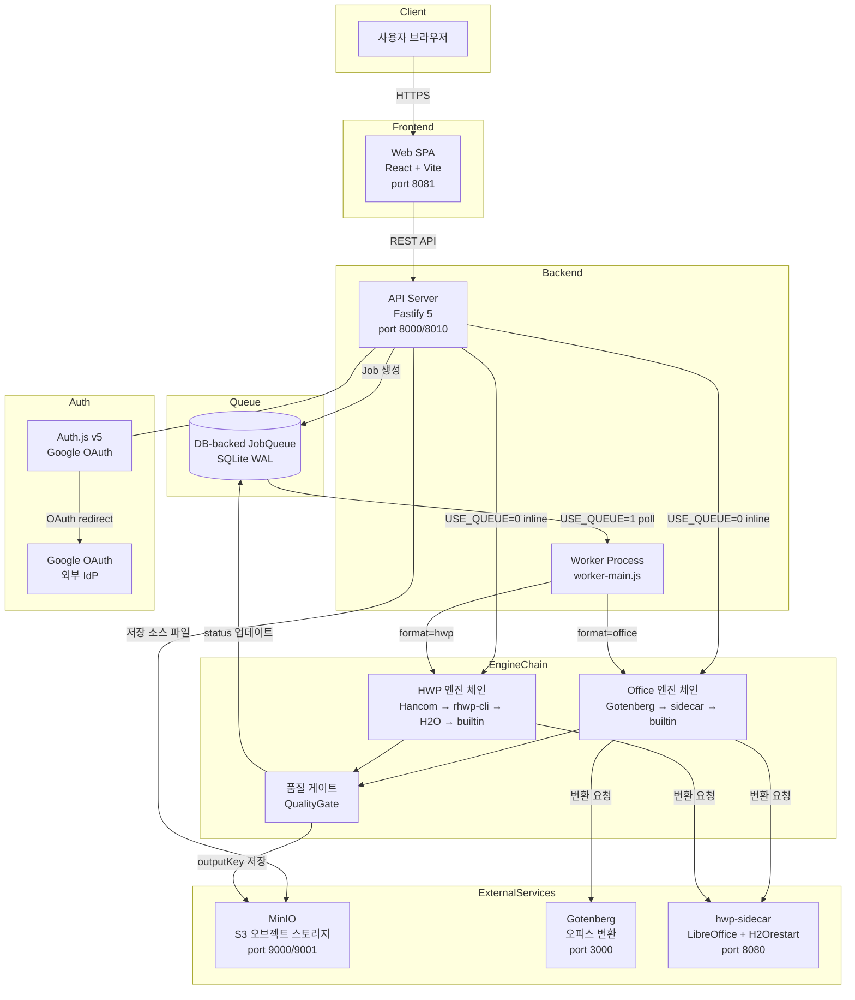
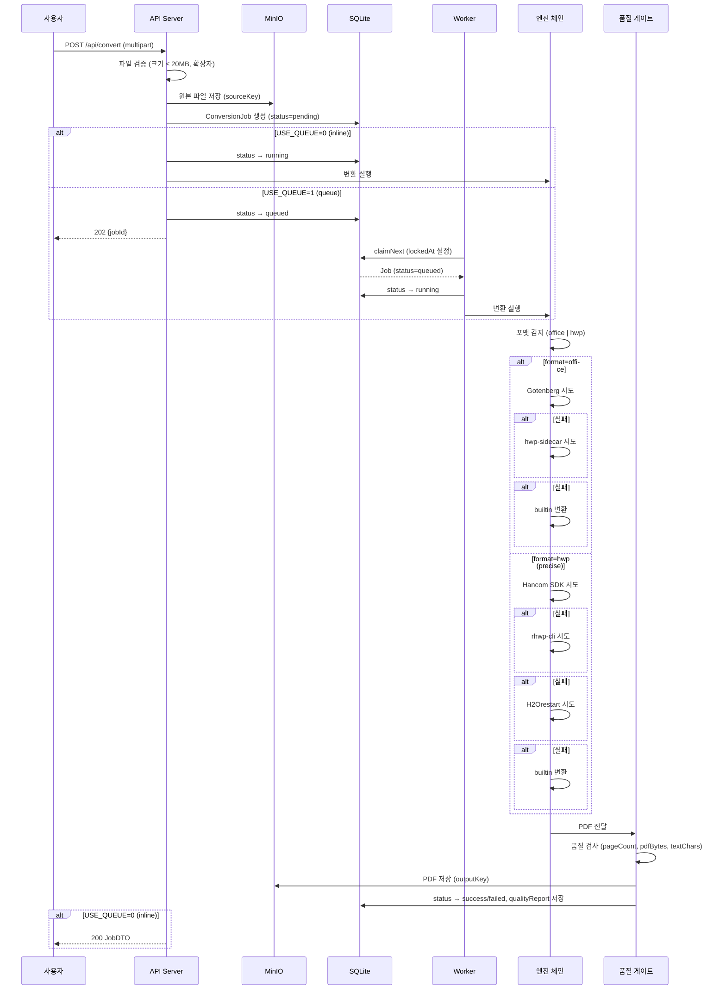
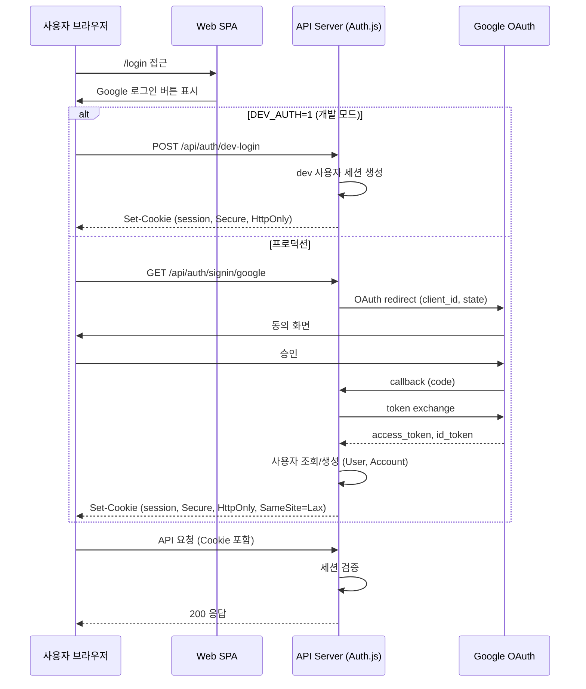

# 시스템 아키텍처 설계서 (System Architecture Design)

> Mass Doc to PDF (mass-doc-to-pdf)의 전체 시스템 아키텍처 설계서. 서비스 구성요소, 데이터 흐름, 인증 흐름, 인프라 구성을 정의한다.

| 항목 | 내용 |
| --- | --- |
| **프로젝트명** | Mass Doc to PDF (mass-doc-to-pdf) |
| **문서 버전** | v1.0 |
| **작성일** | 2026-06-11 |
| **최종 수정일** | 2026-06-11 |
| **작성자** | 개발팀 |
| **문서 상태** | 작성 완료 |

---

## 1. 설계 원칙

| 원칙 | 설명 |
| --- | --- |
| **품질 우선 엔진 체인** | 단일 엔진 의존 금지. HWP는 Hancom SDK → rhwp-cli → H2Orestart → builtin 순서로 fallback하여 변환 성공률을 극대화한다. |
| **Durable Queue** | DB-backed JobQueue로 작업 상태를 영속화한다. 프로세스 재시작·크래시 후에도 작업이 유실되지 않으며, lockedAt/lockedBy로 중복 실행을 방지한다. |
| **포맷 추상화** | `DocFormat("office" | "hwp")`로 포맷을 추상화하여 엔진 체인을 교체·확장해도 API 인터페이스가 변경되지 않는다. |
| **컨테이너 우선** | 모든 서비스는 Docker Compose로 오케스트레이션한다. 로컬 개발과 프로덕션 환경이 동일한 컨테이너 구성을 공유한다. |
| **Storage-Agnostic** | MinIO S3 호환 API를 사용하여 AWS S3, GCS 등 다른 오브젝트 스토리지로 교체가 가능하다. |
| **보안 기본값** | trustProxy, Secure 쿠키, CSRF Origin 검증, rate-limit을 기본으로 적용한다. |

---

## 2. 전체 아키텍처 다이어그램



---

## 3. 서비스 상세

### 3.1 API 서버 (apps/api)

| 항목 | 내용 |
| --- | --- |
| 프레임워크 | Fastify 5 |
| ORM | Prisma 6 |
| DB | SQLite WAL (busy_timeout=5000ms) |
| 인증 | Auth.js v5 세션 쿠키 |
| 역할 | REST API 처리, 파일 업로드, Job 생성, 다운로드/미리보기 응답 |
| 보안 | @fastify/rate-limit (300/min), CSRF Origin 검증, Secure 쿠키, trustProxy |
| 포트 | 8000 (컨테이너 내부) → 8010 (외부 노출) |

**주요 책임:**
- `POST /api/convert`: multipart 업로드 수신 → MinIO 저장 → ConversionJob 생성
- `USE_QUEUE=0` 시 inline 변환 실행
- `USE_QUEUE=1` 시 Job을 `queued` 상태로 DB에 저장하고 Worker가 소비하도록 위임
- 모든 Job 상태 조회 및 파일 다운로드 응답

### 3.2 Worker 프로세스 (apps/api → worker-main.js)

| 항목 | 내용 |
| --- | --- |
| 실행 방식 | api 이미지에서 `node worker-main.js` 실행 |
| 큐 소비 방식 | DB polling (lockedAt IS NULL → 낙관적 잠금) |
| 동시성 | 환경 변수 `WORKER_CONCURRENCY` 설정 가능 |
| 역할 | `queued` 상태 Job을 클레임하여 엔진 체인 실행, 결과 저장 |
| 재시도 | 실패 시 attempts 증가, MAX_ATTEMPTS 초과 시 `failed` 처리 |

### 3.3 hwp-sidecar

| 항목 | 내용 |
| --- | --- |
| 기술 | Python + LibreOffice + H2Orestart |
| 역할 | HWP/HWPX → PDF 변환 (H2Orestart 엔진), Office → PDF 변환 보조 |
| 포트 | 8080 |
| 보안 | 비루트 사용자 실행, LibreOffice 매크로 잠금 |
| PNG 미리보기 | LibreOffice 렌더링으로 첫 페이지 PNG 생성 (캐시 600초) |

### 3.4 Gotenberg

| 항목 | 내용 |
| --- | --- |
| 역할 | DOC/DOCX/PPT/PPTX/XLS/XLSX → PDF 변환 (1차 엔진) |
| 포트 | 3000 |
| 이미지 | gotenberg/gotenberg |

### 3.5 MinIO

| 항목 | 내용 |
| --- | --- |
| 역할 | 원본 파일(sourceKey) 및 변환 PDF(outputKey) 저장 |
| API | S3 호환 (AWS SDK 사용 가능) |
| 포트 | 9000 (API), 9001 (Console) |
| 환경 | `S3_ENDPOINT`, `S3_BUCKET`, `S3_ACCESS_KEY`, `S3_SECRET_KEY` |

---

## 4. 변환 흐름 시퀀스



---

## 5. 인증 흐름



**DEV_AUTH 모드:** `DEV_AUTH=1` 환경 변수 설정 시 Google OAuth 없이 고정 개발 사용자로 로그인 가능. 프로덕션에서는 반드시 비활성화.

---

## 6. 인프라 구성 (Docker Compose)

| 서비스명 | 이미지 | 내부 포트 | 외부 포트 | 역할 |
| --- | --- | --- | --- | --- |
| `minio` | minio/minio | 9000, 9001 | 9000, 9001 | S3 호환 오브젝트 스토리지 |
| `gotenberg` | gotenberg/gotenberg | 3000 | - | Office 문서 → PDF 변환 서비스 |
| `hwp-sidecar` | custom (Python) | 8080 | - | LibreOffice + H2Orestart HWP 변환 |
| `api` | custom (Node.js) | 8000 | 8010 | Fastify REST API 서버 |
| `worker` | api 이미지 재사용 | - | - | worker-main.js 큐 소비 프로세스 |
| `web` | custom (Nginx + React) | 80 | 8081 | React SPA 정적 파일 서빙 |

**네트워크:** 모든 서비스는 동일 Docker Compose 내부 네트워크에 위치. 외부에서는 `api:8010`, `web:8081`, `minio:9000/9001`만 노출.

**볼륨:**
- `minio_data`: MinIO 데이터 영속화
- `sqlite_data`: SQLite DB 파일 영속화
- `sidecar_tmp`: sidecar 임시 변환 파일 (tmpfs 권장)

---

## 7. 환경 변수

| 변수 | 필수 | 기본값 | 설명 |
| --- | --- | --- | --- |
| `DATABASE_URL` | Y | - | SQLite DB 경로 (`file:./dev.db`) |
| `GOTENBERG_URL` | Y | - | Gotenberg 서비스 URL |
| `HWP_SIDECAR_URL` | Y | - | hwp-sidecar URL |
| `S3_ENDPOINT` | Y | - | MinIO/S3 엔드포인트 URL |
| `S3_BUCKET` | Y | - | 스토리지 버킷명 |
| `S3_ACCESS_KEY` | Y | - | S3 액세스 키 |
| `S3_SECRET_KEY` | Y | - | S3 시크릿 키 |
| `AUTH_SECRET` | Y | - | Auth.js 서명 시크릿 (32자 이상 랜덤) |
| `GOOGLE_CLIENT_ID` | Y* | - | Google OAuth 클라이언트 ID (*DEV_AUTH=1 시 불필요) |
| `GOOGLE_CLIENT_SECRET` | Y* | - | Google OAuth 클라이언트 시크릿 |
| `DEV_AUTH` | N | `0` | `1`이면 Google OAuth 없이 dev 로그인 허용 |
| `WEB_ORIGIN` | Y | - | CSRF 허용 Origin (예: `https://example.com`) |
| `PORT` | N | `8000` | API 서버 포트 |
| `USE_QUEUE` | N | `0` | `1`이면 Worker 큐 모드 활성화 |
| `RHWP_CLI_ENABLED` | N | `false` | rhwp-cli 엔진 활성화 여부 |
| `RHWP_CLI_PATH` | N | - | rhwp-cli 실행 파일 경로 |
| `RHWP_FONT_PATHS` | N | - | rhwp 폰트 경로 (콜론 구분) |
| `RHWP_ENABLED` | N | `false` | rhwp H2Orestart 엔진 활성화 여부 |
| `LOG_LEVEL` | N | `info` | pino 로그 레벨 |
| `RATE_LIMIT_MAX` | N | `300` | 전체 API rate limit (req/min) |
| `AUTH_RATE_LIMIT_MAX` | N | `60` | 인증 API rate limit (req/min) |
| `MAX_UPLOAD_BYTES` | N | `20971520` | 최대 업로드 크기 (20MB) |

---

## 8. 확장성 고려사항

| 항목 | 현재 구성 | 확장 방향 |
| --- | --- | --- |
| **수평 확장** | Worker 단일 프로세스 | Worker 컨테이너 레플리카 증가 (lockedBy로 중복 방지) |
| **스토리지** | MinIO (단일 노드) | MinIO 분산 모드 또는 AWS S3 교체 |
| **DB** | SQLite WAL | PostgreSQL 마이그레이션 (Prisma schema 변경 최소화) |
| **엔진 추가** | 4단계 HWP 체인 | 새 엔진 클래스 추가 후 체인 배열에 삽입 |
| **포맷 추가** | office/hwp | `DocFormat` 타입 및 엔진 체인 확장 |
| **인증** | Google OAuth 단일 | Auth.js Provider 추가 (GitHub, Microsoft 등) |
| **모니터링** | GET /health, /api/stats | Prometheus exporter, Grafana 대시보드 추가 |

---

## 9. 모노레포 구조

```
mass-doc-to-pdf/
├── apps/
│   ├── api/              # Fastify 5 + Prisma 6 + SQLite WAL
│   │   ├── src/
│   │   │   ├── routes/   # API 엔드포인트
│   │   │   ├── engines/  # 변환 엔진 체인
│   │   │   ├── queue/    # DB-backed JobQueue
│   │   │   └── storage/  # MinIO S3 클라이언트
│   │   └── worker-main.js
│   └── web/              # React + Vite + TanStack Query
│       └── src/
│           ├── pages/    # 화면 컴포넌트
│           └── components/
├── packages/
│   └── shared/           # 공용 타입 (DocFormat, JobStatus 등)
├── hwp-sidecar/          # Python + LibreOffice + H2Orestart
├── e2e/                  # Playwright E2E 테스트
├── standalone/           # Docker 없는 Ubuntu systemd/nginx 배포 패키지
└── docker-compose.yml
```

---

## 10. 관련 문서

| 문서명 | 위치 |
| --- | --- |
| 서비스 기획서 | `docs/waterfall/00-planning/service-planning.md` |
| API 설계서 | `docs/waterfall/02-system-design/api-design.md` |
| DB 설계서 | `docs/waterfall/02-system-design/database-design.md` |
| UI 설계서 | `docs/waterfall/02-system-design/ui-design.md` |

---

## 11. 변경 이력

| 버전 | 날짜 | 작성자 | 변경 내용 |
| --- | --- | --- | --- |
| v1.0 | 2026-06-11 | 개발팀 | 초안 작성 |
