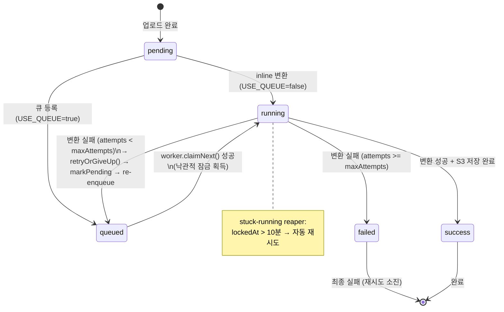
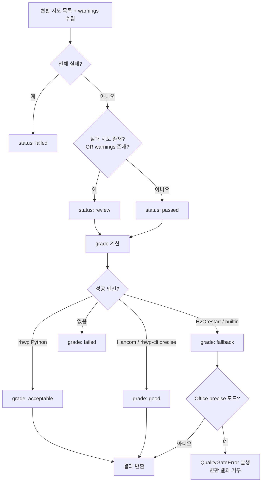
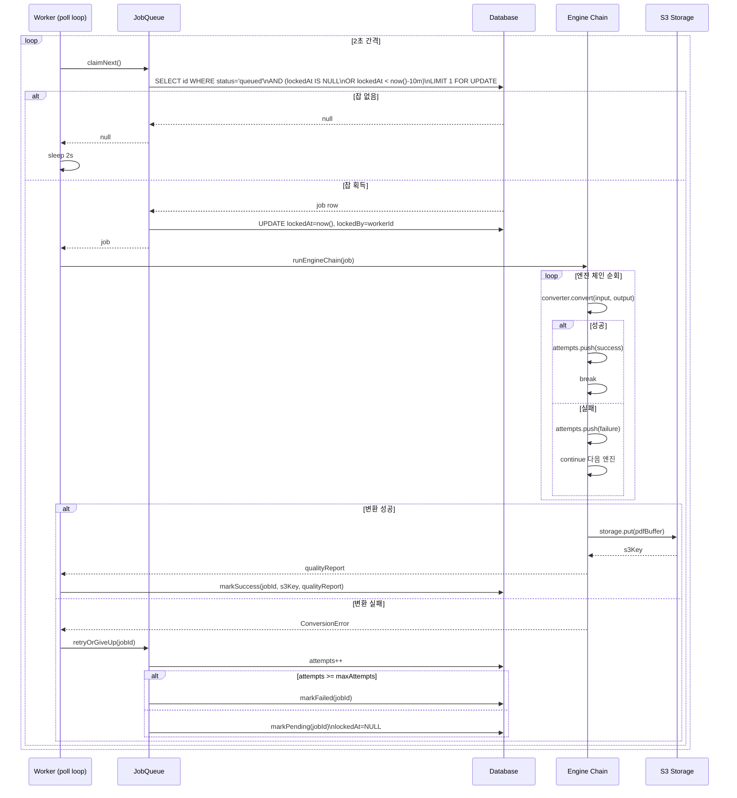
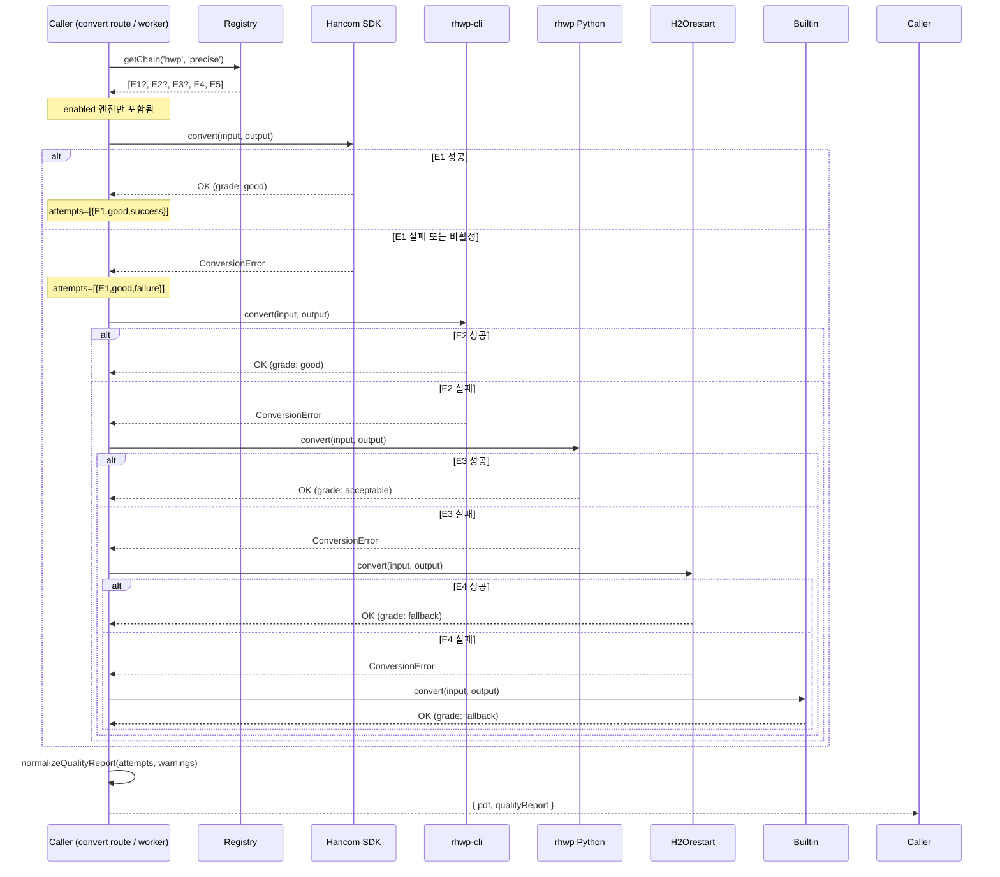
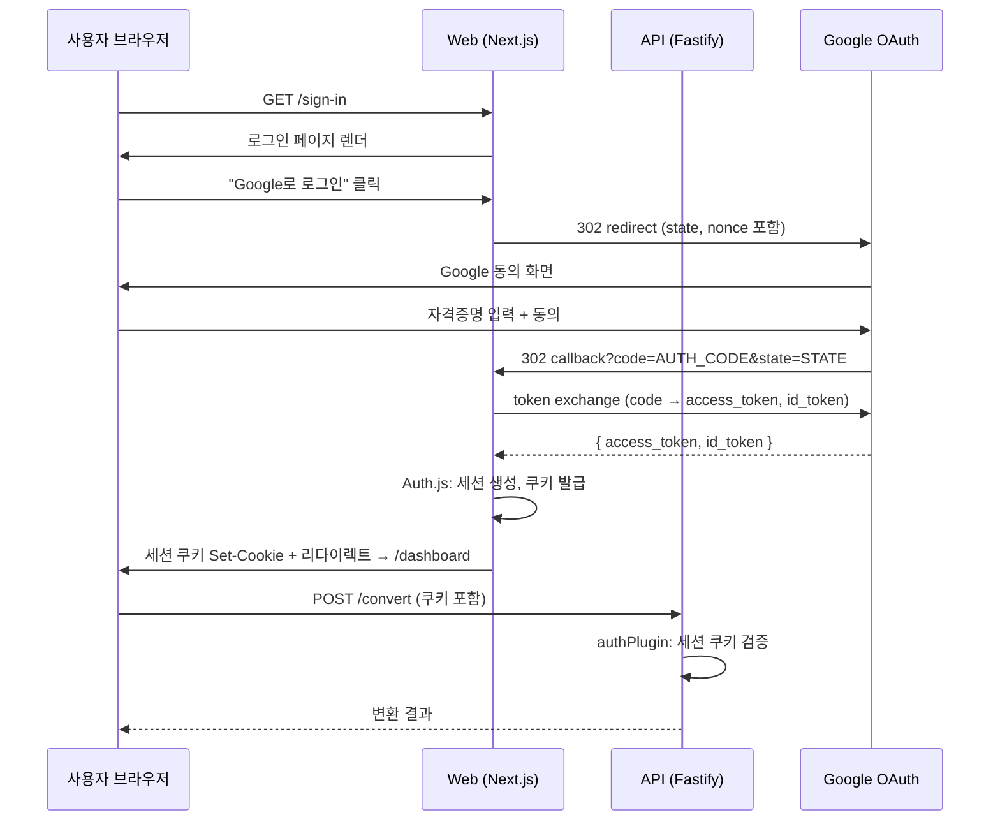
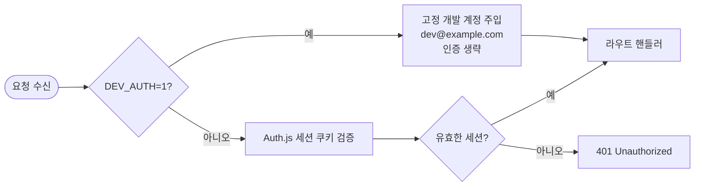
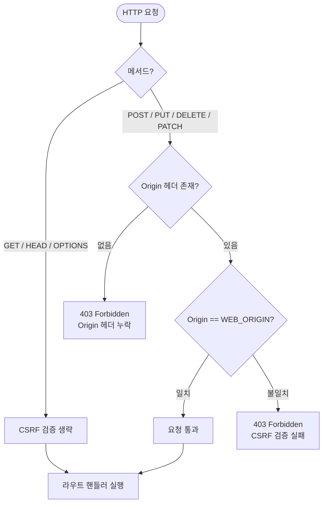

# 상태 머신 및 시퀀스 다이어그램

| 항목 | 내용 |
|------|------|
| 문서 번호 | WF-03-02 |
| 버전 | v1.0 |
| 작성일 | 2026-06-11 |
| 작성자 | 개발팀 |
| 상태 | 확정 |

---

## 1. ConversionJob 상태 머신

### 상태 전이 상세

| 이전 상태 | 이후 상태 | 트리거 | 담당 모듈 |
|-----------|-----------|--------|-----------|
| `pending` | `running` | `USE_QUEUE=false`일 때 업로드 직후 인라인 실행 | `routes/convert.ts` |
| `pending` | `queued` | `USE_QUEUE=true`일 때 큐에 등록 | `routes/convert.ts` |
| `queued` | `running` | `worker.claimNext()` 낙관적 잠금 성공 | `queue/worker.ts` |
| `running` | `success` | 변환 완료, S3 업로드, DB 업데이트 | `jobs/jobService.ts` |
| `running` | `queued` | 실패 but `attempts < maxAttempts` | `queue/jobQueue.ts` |
| `running` | `failed` | 실패 and `attempts >= maxAttempts` | `queue/jobQueue.ts` |
| `running` | `queued` | stuck-running reaper가 10분 초과 감지 | `queue/worker.ts` |

---

## 2. 품질 상태 결정 로직

---

## 3. 워커 폴 시퀀스 다이어그램

---

## 4. 엔진 체인 폴백 시퀀스

---

## 5. 인증 흐름

### 5.1 Google OAuth 시퀀스

### 5.2 DEV_AUTH=1 분기

---

## 6. CSRF 검증 흐름

`WEB_ORIGIN`은 환경변수 `WEB_ORIGIN`으로 설정되며, 기본값은 `http://localhost:3000`이다. Nginx/로드밸런서 뒤에서 동작 시 `trustProxy: true` 설정이 필요하다.

---

## 변경 이력

| 버전 | 날짜 | 변경 내용 | 작성자 |
|------|------|-----------|--------|
| v1.0 | 2026-06-11 | 최초 작성 | 개발팀 |
