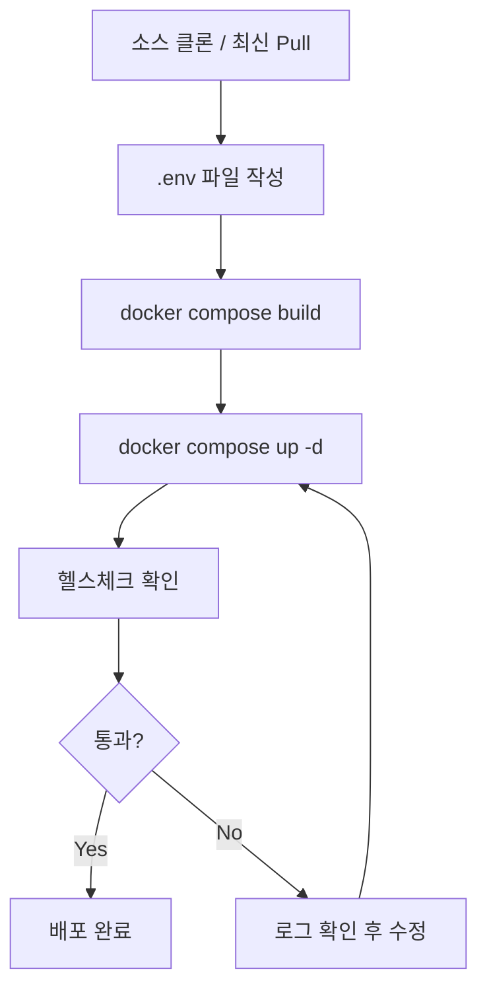
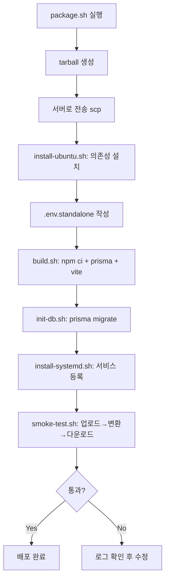
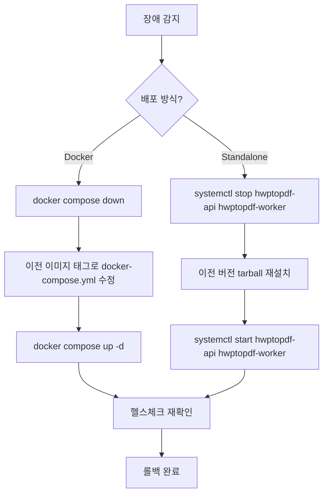

# 배포 계획서 (Deployment Plan)

> Mass Doc to PDF 서비스의 배포 절차, 환경 요건, 롤백 절차를 정의한다.

| 항목 | 내용 |
| --- | --- |
| **프로젝트명** | Mass Doc to PDF (mass-doc-to-pdf) |
| **문서 버전** | v1.0 |
| **작성일** | 2026-06-11 |
| **최종 수정일** | 2026-06-11 |
| **작성자** | 개발팀 |
| **문서 상태** | 확정 |

---

## 1. 배포 환경 요건

### 1.1 배포 방식 비교

| 항목 | Docker Compose | Standalone (systemd) |
| --- | --- | --- |
| **OS** | Docker 지원 OS (Linux/macOS) | Ubuntu 22.04 LTS 이상 |
| **필수 소프트웨어** | Docker Engine 24+, Docker Compose v2 | Node.js 20+, npm, LibreOffice 7+, nginx |
| **스토리지** | MinIO 컨테이너 (S3 호환) | 로컬 파일시스템 (`./data/objects`) |
| **DB** | SQLite (컨테이너 볼륨) | SQLite (`./data/app.db`) |
| **HWP 변환** | hwp-sidecar 컨테이너 (LibreOffice + H2Orestart) | LibreOffice 직접 설치 + rhwp |
| **Office 변환** | Gotenberg 컨테이너 | LibreOffice (builtin 엔진) |
| **역방향 프록시** | 없음 (포트 직접 노출) 또는 별도 nginx | nginx (시스템 패키지) |
| **권장 사용 환경** | 개발, 스테이징, 컨테이너 기반 운영 | 단일 서버, VPS, 베어메탈 |
| **스케일 아웃** | Compose 서비스 복제 | 수동 (worker 프로세스 추가) |

### 1.2 Docker Compose 최소 요건

| 항목 | 최솟값 |
| --- | --- |
| CPU | 2 vCPU |
| RAM | 4 GB |
| 디스크 | 20 GB (OS + 이미지 + 데이터) |
| Docker Engine | 24.0+ |
| Docker Compose | v2.20+ |
| 개방 포트 | 8010 (API), 8081 (Web), 9000/9001 (MinIO 옵션) |

### 1.3 Standalone 최소 요건

| 항목 | 최솟값 |
| --- | --- |
| CPU | 2 vCPU |
| RAM | 4 GB |
| 디스크 | 20 GB |
| OS | Ubuntu 22.04 LTS |
| Node.js | 20 LTS |
| LibreOffice | 7.5+ |
| nginx | 1.18+ |
| 개방 포트 | 80 (nginx), 필요시 443 (HTTPS) |

---

## 2. Docker Compose 배포 절차



### 2.1 단계별 절차

**Step 1. 소스 준비**
```bash
git clone <repo-url> hwptopdf
cd hwptopdf
# 또는 기존 디렉토리에서
git pull origin main
```

**Step 2. 환경변수 설정**
```bash
cp .env.example .env
# 필수 항목 편집 (섹션 4 참고)
vi .env
```

**Step 3. 이미지 빌드**
```bash
docker compose build --no-cache
```

**Step 4. 서비스 기동**
```bash
docker compose up -d
```

**Step 5. 기동 상태 확인**
```bash
docker compose ps
# 모든 서비스 Status: Up 확인
```

**Step 6. 헬스체크**
```bash
curl -s http://localhost:8010/health
# 기대 응답: {"status":"ok"}
```

**Step 7. 통계 엔드포인트 확인**
```bash
curl -s http://localhost:8010/api/stats
```

---

## 3. Standalone 배포 절차



### 3.1 단계별 절차

**Step 1. 패키지 생성 (로컬)**
```bash
cd standalone
./scripts/package.sh
# 생성 위치: dist/hwptopdf-standalone-<version>.tar.gz
```

**Step 2. 서버 전송**
```bash
scp dist/hwptopdf-standalone-*.tar.gz user@server:/opt/hwptopdf/
ssh user@server
cd /opt/hwptopdf
tar -xzf hwptopdf-standalone-*.tar.gz
```

**Step 3. 의존성 설치**
```bash
sudo ./standalone/scripts/install-ubuntu.sh
# Node.js 20 LTS, LibreOffice, nginx, fonts 설치
```

**Step 4. 환경변수 설정**
```bash
cp standalone/env.example .env.standalone
vi .env.standalone
# 필수 항목: AUTH_SECRET, WEB_ORIGIN, DATABASE_URL, S3_* 설정
```

**Step 5. 빌드**
```bash
./standalone/scripts/build.sh
# npm ci, prisma generate, vite build 순 실행
```

**Step 6. DB 초기화**
```bash
./standalone/scripts/init-db.sh
# prisma migrate deploy 실행
```

**Step 7. systemd 서비스 등록**
```bash
sudo ./standalone/scripts/install-systemd.sh
sudo systemctl enable hwptopdf-api hwptopdf-worker
sudo systemctl start hwptopdf-api hwptopdf-worker
```

**Step 8. 스모크 테스트**
```bash
./standalone/scripts/smoke-test.sh
# 업로드 → 변환 → 다운로드 end-to-end 검증
```

**기본 포트 배분 (Standalone)**

| 서비스 | 바인드 주소 | 포트 |
| --- | --- | --- |
| nginx (외부) | 0.0.0.0 | 80 |
| API (내부) | 127.0.0.1 | 18010 |
| HWP Sidecar (내부) | 127.0.0.1 | 18080 |
| SQLite DB | 파일 | `./data/app.db` |
| 파일 스토리지 | 파일 | `./data/objects` |

---

## 4. 환경변수 설정 가이드

### 4.1 필수 항목 (미설정 시 서비스 기동 불가)

| 변수 | 예시 값 | 설명 |
| --- | --- | --- |
| `AUTH_SECRET` | `openssl rand -base64 32` 출력값 | JWT 서명 키. 32바이트 이상 무작위값 필수 |
| `WEB_ORIGIN` | `https://pdf.example.com` | CSRF 검증용 허용 출처. 운영 URL 정확히 입력 |
| `DATABASE_URL` | `file:./data/app.db` | SQLite 파일 경로 |
| `S3_ENDPOINT` | `http://minio:9000` | MinIO 또는 S3 엔드포인트 |
| `S3_BUCKET` | `hwptopdf` | 버킷명 |
| `S3_ACCESS_KEY` | — | 스토리지 접근 키 |
| `S3_SECRET_KEY` | — | 스토리지 시크릿 키 |

> **주의:** `DEV_AUTH=1`은 개발 환경 전용. 운영 배포에서는 반드시 `DEV_AUTH=0` (기본값) 유지.

### 4.2 권장 항목

| 변수 | 권장값 | 설명 |
| --- | --- | --- |
| `USE_QUEUE` | `1` | durable queue 활성화. 모든 배포 환경 권장 |
| `TRUST_PROXY` | `1` | nginx 뒤 배포 시 X-Forwarded-Proto 적용 |
| `LOG_LEVEL` | `info` | 운영: info, 디버깅: debug |
| `RATE_LIMIT_MAX` | `300` | 분당 전체 요청 한도 |
| `AUTH_RATE_LIMIT_MAX` | `60` | 분당 인증 요청 한도 |
| `OFFICE_ENGINE` | `gotenberg` | Docker: gotenberg, Standalone: builtin |

### 4.3 HWP 엔진 항목

| 변수 | 기본값 | 설명 |
| --- | --- | --- |
| `RHWP_ENABLED` | `true` | Python rhwp 활성화 |
| `RHWP_CLI_ENABLED` | `false` | rhwp-cli 바이너리 활성화 |
| `RHWP_CLI_PATH` | `rhwp` | rhwp-cli 바이너리 경로 |
| `RHWP_FONT_PATHS` | — | 추가 폰트 경로 (콜론 구분) |
| `HWP_SIDECAR_URL` | `http://hwp-sidecar:8080` | HWP 사이드카 URL |

---

## 5. 헬스체크 확인 절차

### 5.1 Docker Compose

```bash
# API 헬스체크
curl -s http://localhost:8010/health | jq .
# 기대: {"status":"ok"}

# 통계 확인
curl -s http://localhost:8010/api/stats | jq .

# 컨테이너 상태
docker compose ps
docker compose logs --tail=50 api
docker compose logs --tail=50 worker
```

### 5.2 Standalone

```bash
# API 헬스체크 (nginx 경유)
curl -s http://localhost/health | jq .

# 서비스 상태
systemctl status hwptopdf-api
systemctl status hwptopdf-worker

# 로그
journalctl -u hwptopdf-api -n 50 --no-pager
journalctl -u hwptopdf-worker -n 50 --no-pager
```

---

## 6. 롤백 절차



### 6.1 Docker Compose 롤백

```bash
# 즉각 재시작 (설정 오류 시)
docker compose restart api worker

# 이전 버전으로 롤백
docker compose down
# docker-compose.yml에서 image 태그를 이전 버전으로 수정
docker compose up -d
```

### 6.2 Standalone 롤백

```bash
# 서비스 중지
sudo systemctl stop hwptopdf-api hwptopdf-worker

# 이전 tarball 재설치
cd /opt/hwptopdf
tar -xzf hwptopdf-standalone-<prev-version>.tar.gz
./standalone/scripts/build.sh

# 서비스 재시작
sudo systemctl start hwptopdf-api hwptopdf-worker

# 헬스체크
curl -s http://localhost/health
```

### 6.3 DB 롤백 (마이그레이션 실패 시)

```bash
# 백업에서 복원
cp data/app.db.backup data/app.db
# 서비스 재시작
```

---

## 7. 배포 체크리스트

### 7.1 배포 전

- [ ] `AUTH_SECRET` 32바이트 이상 무작위값 설정
- [ ] `WEB_ORIGIN` 운영 URL로 설정
- [ ] `DEV_AUTH=0` 확인 (기본값)
- [ ] `USE_QUEUE=1` 설정
- [ ] `TRUST_PROXY=1` 설정 (nginx 뒤 배포)
- [ ] S3/MinIO 자격증명 확인
- [ ] `.env` 파일 권한 600 확인
- [ ] DB 백업 완료
- [ ] 이전 버전 tarball/이미지 보관 확인

### 7.2 배포 후

- [ ] `/health` → `{"status":"ok"}` 확인
- [ ] `/api/stats` 응답 정상 확인
- [ ] 로그에 ERROR 없음 확인
- [ ] 스모크 테스트: 파일 업로드 → 변환 → 다운로드 성공
- [ ] 레이트 리밋 적용 확인 (429 응답 테스트)
- [ ] CSRF 검증 동작 확인

---

## 변경 이력

| 버전 | 날짜 | 변경 내용 | 작성자 |
| --- | --- | --- | --- |
| v1.0 | 2026-06-11 | 초기 작성 | 개발팀 |
