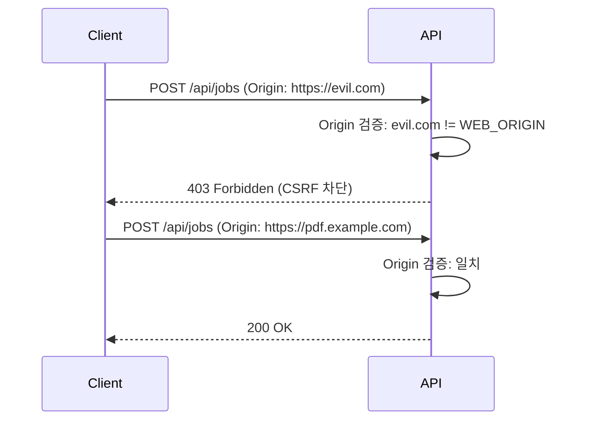
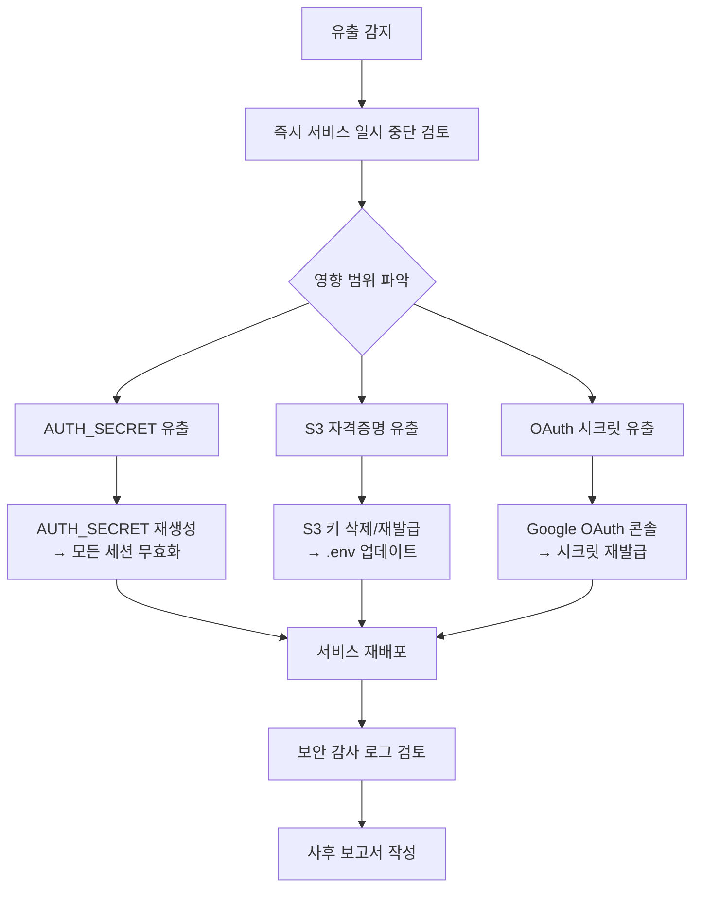

# 환경변수 보안 가이드 (Environment Security Guide)

> Mass Doc to PDF 서비스의 시크릿 관리, 보안 설정, 사고 대응 절차를 정의한다.

| 항목 | 내용 |
| --- | --- |
| **프로젝트명** | Mass Doc to PDF (mass-doc-to-pdf) |
| **문서 버전** | v1.0 |
| **작성일** | 2026-06-11 |
| **최종 수정일** | 2026-06-11 |
| **작성자** | 개발팀 |
| **문서 상태** | 확정 |

---

## 1. 시크릿 저장 매트릭스

| 변수명 | 민감도 | 저장 위치 | 노출 방지 방법 |
| --- | --- | --- | --- |
| `AUTH_SECRET` | 최고 | `.env` (파일 권한 600), Docker Secret / Vault | 로그 마스킹, git 제외(.gitignore), 정기 로테이션 |
| `S3_SECRET_KEY` | 최고 | `.env` (파일 권한 600) | 로그 마스킹, git 제외, 최소 권한 IAM |
| `S3_ACCESS_KEY` | 높음 | `.env` (파일 권한 600) | 로그 마스킹, git 제외 |
| `GOOGLE_CLIENT_SECRET` | 최고 | `.env` (파일 권한 600) | 로그 마스킹, git 제외, OAuth 콘솔에서 제한 |
| `GOOGLE_CLIENT_ID` | 낮음 | `.env` | 공개 노출 무방하나 git 제외 권장 |
| `DATABASE_URL` | 중간 | `.env` | DB 파일 경로. 외부 공개 금지 |
| `WEB_ORIGIN` | 낮음 | `.env` | 설정값. 노출되어도 직접 피해 없음 |
| `LOG_LEVEL` | 낮음 | `.env` | 비민감. 그러나 debug 수준 로그는 민감 정보 포함 가능 |
| `DEV_AUTH` | 중간 | `.env` | 운영에서 `0` 강제. CI/CD에서 override 금지 |
| `RATE_LIMIT_MAX` | 낮음 | `.env` | 비민감 설정값 |

---

## 2. 필수 보안 설정 체크리스트

### 2.1 배포 전 필수 확인

- [ ] `AUTH_SECRET`: `openssl rand -base64 32` 출력값 사용 (32바이트 이상)
- [ ] `AUTH_SECRET`: 환경 간 공유 금지 (개발/스테이징/운영 각각 별도 생성)
- [ ] `DEV_AUTH=0` 확인 (기본값. 운영에서 절대 `1` 사용 금지)
- [ ] `WEB_ORIGIN`: 운영 도메인 URL로 정확히 설정 (`https://pdf.example.com`)
- [ ] HTTPS 적용 확인 (nginx SSL 설정 또는 CDN/로드밸런서 TLS 종단)
- [ ] `.env` 파일 소유자 확인 및 권한 600 설정
- [ ] `.gitignore`에 `.env*` 패턴 포함 확인

### 2.2 강도 기준

| 변수 | 최소 기준 | 권장 기준 |
| --- | --- | --- |
| `AUTH_SECRET` | 32바이트 무작위 | 64바이트 무작위 (`openssl rand -base64 64`) |
| `S3_SECRET_KEY` | 공급자 생성값 | 최소 권한 IAM 정책 적용 |
| `GOOGLE_CLIENT_SECRET` | OAuth 콘솔 발급값 | 허용 리디렉션 URI 최소화 |

---

## 3. Rate Limiting 설정 가이드

### 3.1 설정 구조

```mermaid
graph TD
    Request[모든 요청] --> GlobalRL["전체 Rate Limit\nRATE_LIMIT_MAX=300/min"]
    GlobalRL --> HealthCheck{"/health 경로?"}
    HealthCheck -- Yes --> Skip[제외 (헬스체크 무한 허용)]
    HealthCheck -- No --> AuthCheck{"/auth/* 경로?"}
    AuthCheck -- Yes --> AuthRL["Auth Rate Limit\nAUTH_RATE_LIMIT_MAX=60/min"]
    AuthCheck -- No --> Normal[일반 처리]
    AuthRL --> Proceed[처리]
    Normal --> Proceed
```

### 3.2 환경변수 설정

```bash
# 전체 요청 한도 (IP당 분당)
RATE_LIMIT_MAX=300

# 인증 요청 한도 (로그인, 가입 등)
AUTH_RATE_LIMIT_MAX=60

# /health 엔드포인트: rate limit 제외 (헬스체크 시스템이 429를 받지 않도록)
```

### 3.3 운영 환경별 권장값

| 환경 | `RATE_LIMIT_MAX` | `AUTH_RATE_LIMIT_MAX` | 비고 |
| --- | --- | --- | --- |
| 개발 | 3000 | 600 | 제한 완화 |
| 스테이징 | 300 | 60 | 운영과 동일 |
| 운영 (소규모) | 300 | 60 | 기본값 |
| 운영 (대규모) | 1000 | 100 | 트래픽에 맞게 상향 |

### 3.4 429 대응

클라이언트가 429를 받으면 `Retry-After` 헤더 값만큼 대기 후 재시도한다:

```
HTTP/1.1 429 Too Many Requests
Retry-After: 60
Content-Type: application/json

{"error":"Too Many Requests","retryAfter":60}
```

---

## 4. CSRF 방어 설정

### 4.1 방어 메커니즘

서비스는 `Origin` 헤더를 검증하여 CSRF를 방어한다. 모든 상태 변경 요청(POST/PUT/DELETE)에 대해 `Origin` 값이 `WEB_ORIGIN`과 일치하는지 확인한다.



### 4.2 WEB_ORIGIN 설정 규칙

```bash
# 올바른 설정 (프로토콜 포함, 후행 슬래시 없음)
WEB_ORIGIN=https://pdf.example.com

# 틀린 설정 (CSRF 검증 실패 원인)
WEB_ORIGIN=pdf.example.com          # 프로토콜 없음
WEB_ORIGIN=https://pdf.example.com/ # 후행 슬래시
WEB_ORIGIN=*                         # 와일드카드 절대 금지
```

### 4.3 개발 환경

```bash
# 개발 환경에서는 localhost 허용
WEB_ORIGIN=http://localhost:8081
# 또는 Vite 개발 서버 포트
WEB_ORIGIN=http://localhost:5173
```

---

## 5. 파일 권한 보안

### 5.1 필수 파일 권한

```bash
# .env 파일 (시크릿 포함)
chmod 600 .env
chmod 600 .env.standalone

# DB 파일 (민감 데이터)
chmod 600 ./data/app.db
chmod 600 ./data/app.db-wal
chmod 600 ./data/app.db-shm

# 데이터 디렉토리
chmod 700 ./data/
chmod 700 ./data/objects/

# 설정 파일 검증
ls -la .env ./data/app.db
```

### 5.2 소유자 설정

```bash
# 서비스 실행 사용자와 일치시킴
# hwptopdf 전용 시스템 사용자 사용 권장
sudo useradd -r -s /bin/false hwptopdf
sudo chown -R hwptopdf:hwptopdf /opt/hwptopdf/data
```

### 5.3 Docker 볼륨 권한

```bash
# 볼륨 권한 확인
docker compose exec api ls -la /app/data/

# 볼륨 바인드 마운트 시 호스트 권한 설정
chmod 700 ./volumes/data
```

---

## 6. 보안 사고 대응 절차

### 6.1 시크릿 유출 감지 시



### 6.2 AUTH_SECRET 유출 시

```bash
# 1. 새 시크릿 생성
NEW_SECRET=$(openssl rand -base64 32)

# 2. .env 업데이트
# AUTH_SECRET=<NEW_SECRET>

# 3. 서비스 재시작 (기존 JWT 토큰 전체 무효화)
docker compose restart api   # Docker
sudo systemctl restart hwptopdf-api  # Standalone

# 4. 영향: 모든 로그인 사용자 세션 종료 (재로그인 필요)
```

### 6.3 S3 자격증명 유출 시

```bash
# 1. 즉시 기존 키 비활성화 (MinIO 콘솔 또는 AWS IAM)
# MinIO: http://localhost:9001 → Access Keys → 비활성화

# 2. 새 키 발급
# MinIO 콘솔 → Access Keys → Create access key

# 3. .env 업데이트
# S3_ACCESS_KEY=<NEW_KEY>
# S3_SECRET_KEY=<NEW_SECRET>

# 4. 서비스 재시작
docker compose restart api worker
```

### 6.4 OAuth 시크릿 유출 시

```bash
# 1. Google Cloud Console 접속
# https://console.cloud.google.com/apis/credentials

# 2. 해당 OAuth 2.0 클라이언트 → 시크릿 재생성

# 3. .env 업데이트
# GOOGLE_CLIENT_SECRET=<NEW_SECRET>

# 4. 서비스 재시작
docker compose restart api
```

### 6.5 git 기록에 시크릿이 포함된 경우

```bash
# git history에서 시크릿 제거 (BFG Repo-Cleaner 사용)
# https://rtyley.github.io/bfg-repo-cleaner/

# 또는 git filter-branch (느림)
git filter-branch --force --index-filter \
  "git rm --cached --ignore-unmatch .env" \
  --prune-empty --tag-name-filter cat -- --all

# 원격 저장소 force push (주의: 팀 전체 재클론 필요)
git push origin --force --all

# GitHub의 경우: Support에 캐시 제거 요청
```

### 6.6 사고 보고서 항목

| 항목 | 내용 |
| --- | --- |
| 발생 일시 | YYYY-MM-DD HH:MM |
| 감지 방법 | 모니터링 알림 / 사용자 제보 / 코드 리뷰 |
| 유출 범위 | 영향받은 시크릿 종류 및 노출 기간 |
| 즉각 조치 | 시크릿 로테이션, 서비스 재시작 등 |
| 근본 원인 | git 커밋, 로그 노출, 서버 침해 등 |
| 재발 방지 | pre-commit hook, secret scanning, Vault 도입 등 |

---

## 변경 이력

| 버전 | 날짜 | 변경 내용 | 작성자 |
| --- | --- | --- | --- |
| v1.0 | 2026-06-11 | 초기 작성 | 개발팀 |
