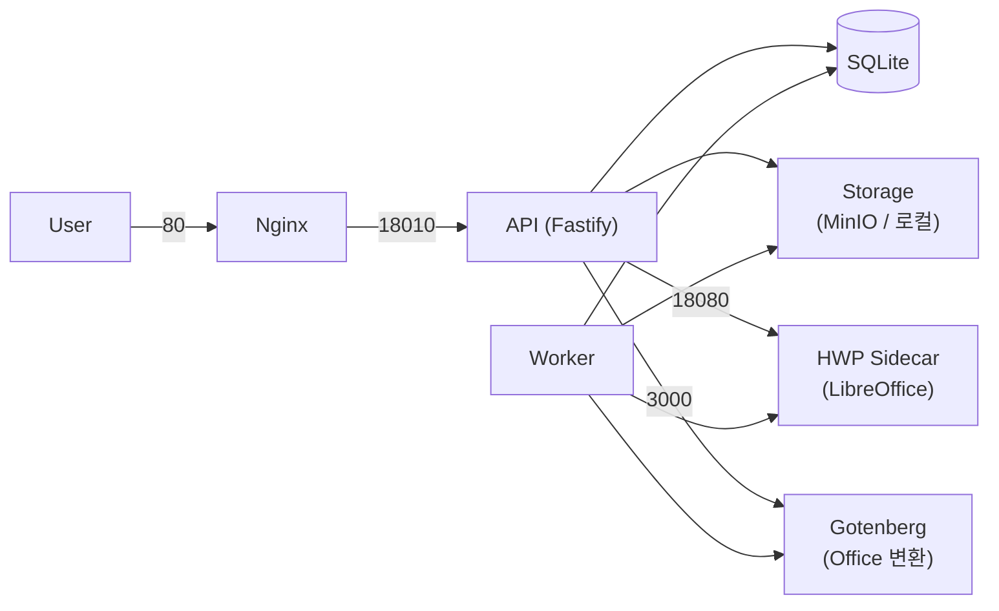
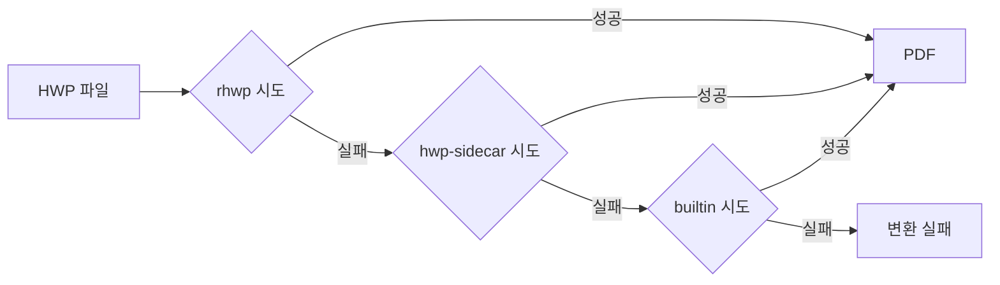

# 운영 가이드 (Operations Guide)

> Mass Doc to PDF 서비스의 일상 운영, 모니터링, 문제 해결 절차를 정의한다.

| 항목 | 내용 |
| --- | --- |
| **프로젝트명** | Mass Doc to PDF (mass-doc-to-pdf) |
| **문서 버전** | v1.0 |
| **작성일** | 2026-06-11 |
| **최종 수정일** | 2026-06-11 |
| **작성자** | 개발팀 |
| **문서 상태** | 확정 |

---

## 1. 일상 운영 절차

### 1.1 서비스 시작 / 중지 / 재시작

#### Docker Compose

```bash
# 시작
docker compose up -d

# 중지
docker compose down

# 재시작 (전체)
docker compose restart

# 개별 서비스 재시작
docker compose restart api
docker compose restart worker
docker compose restart hwp-sidecar
```

#### Standalone (systemd)

```bash
# 시작
sudo systemctl start hwptopdf-api hwptopdf-worker

# 중지
sudo systemctl stop hwptopdf-api hwptopdf-worker

# 재시작
sudo systemctl restart hwptopdf-api
sudo systemctl restart hwptopdf-worker

# 상태 확인
systemctl status hwptopdf-api
systemctl status hwptopdf-worker
```

### 1.2 서비스 구성 요약



---

## 2. 로그 확인

### 2.1 Docker Compose

```bash
# 전체 로그 (최근 100줄)
docker compose logs --tail=100

# API 로그 실시간
docker compose logs -f api

# Worker 로그 실시간
docker compose logs -f worker

# 오류만 필터
docker compose logs api | grep -i error

# 특정 시간 이후 로그
docker compose logs --since="2026-06-11T09:00:00" api
```

### 2.2 Standalone (journalctl)

```bash
# API 최근 로그
journalctl -u hwptopdf-api -n 100 --no-pager

# Worker 실시간 로그
journalctl -u hwptopdf-worker -f

# 오늘 로그 전체
journalctl -u hwptopdf-api --since today

# 오류 레벨만
journalctl -u hwptopdf-api -p err --no-pager

# 특정 시간 범위
journalctl -u hwptopdf-api --since="2026-06-11 09:00" --until="2026-06-11 10:00"
```

### 2.3 로그 레벨 조정

```bash
# .env 또는 .env.standalone에서
LOG_LEVEL=debug    # 상세 디버깅
LOG_LEVEL=info     # 운영 표준
LOG_LEVEL=warn     # 경고 이상만
LOG_LEVEL=error    # 오류만
```

---

## 3. 모니터링

### 3.1 헬스체크 엔드포인트

```bash
# 기본 헬스체크
curl -s http://localhost:8010/health
# 응답: {"status":"ok"}

# 통계 (Docker)
curl -s http://localhost:8010/api/stats | jq .

# 통계 (Standalone, nginx 경유)
curl -s http://localhost/api/stats | jq .
```

### 3.2 stats 응답 해석

```json
{
  "total": 150,
  "success": 142,
  "failed": 5,
  "running": 3
}
```

| 필드 | 설명 | 임계값 |
| --- | --- | --- |
| `total` | 전체 작업 수 | — |
| `success` | 성공 작업 수 | 성공률 = success/total × 100 |
| `failed` | 실패 작업 수 | 실패율 5% 이상 시 주의 |
| `running` | 현재 진행 중 | 10분 이상 지속 시 stuck 의심 |

### 3.3 큐 상태 확인

```bash
# SQLite에서 직접 큐 상태 조회 (Standalone)
sqlite3 ./data/app.db "SELECT status, COUNT(*) FROM Job GROUP BY status;"

# running 상태가 오래된 작업 확인 (10분 이상)
sqlite3 ./data/app.db "
  SELECT id, status, lockedAt, createdAt
  FROM Job
  WHERE status='running'
    AND lockedAt < datetime('now', '-10 minutes');
"
```

### 3.4 Stuck-Running Reaper

서비스에 자동 reaper가 내장되어 있다:
- `lockedAt > 10분` 조건의 running 작업을 자동으로 재시도 상태로 전환
- 별도 수동 개입 없이 자동 복구
- 수동 강제 재시도가 필요한 경우 아래 참고

```bash
# 수동 stuck 작업 초기화 (Standalone)
sqlite3 ./data/app.db "
  UPDATE Job
  SET status='pending', lockedAt=NULL
  WHERE status='running'
    AND lockedAt < datetime('now', '-10 minutes');
"
```

---

## 4. DB 백업

### 4.1 SQLite 백업 절차

SQLite WAL 모드에서 안전한 백업을 위해 `.backup` 명령을 사용한다.

```bash
# WAL 체크포인트 후 백업 (권장)
sqlite3 ./data/app.db ".backup './data/app.db.backup-$(date +%Y%m%d-%H%M%S)'"

# 단순 파일 복사 (서비스 중지 후)
sudo systemctl stop hwptopdf-api hwptopdf-worker
cp ./data/app.db ./data/app.db.backup-$(date +%Y%m%d)
sudo systemctl start hwptopdf-api hwptopdf-worker
```

### 4.2 WAL 체크포인트

```bash
# WAL 파일을 메인 DB에 병합
sqlite3 ./data/app.db "PRAGMA wal_checkpoint(FULL);"
```

### 4.3 백업 자동화 예시 (crontab)

```cron
# 매일 새벽 3시 DB 백업
0 3 * * * sqlite3 /opt/hwptopdf/data/app.db ".backup '/opt/hwptopdf/data/backups/app.db.$(date +\%Y\%m\%d)'"

# 7일 이상 된 백업 삭제
0 4 * * * find /opt/hwptopdf/data/backups -name "app.db.*" -mtime +7 -delete
```

### 4.4 Docker Compose 백업

```bash
# 볼륨 데이터 백업
docker compose exec api sqlite3 /app/data/app.db ".backup '/app/data/app.db.backup'"
docker cp hwptopdf-api-1:/app/data/app.db.backup ./backups/
```

---

## 5. 스토리지 관리

### 5.1 용량 확인

#### Docker (MinIO)

```bash
# MinIO 컨테이너 볼륨 용량
docker system df

# MinIO mc CLI로 버킷 용량
docker compose exec minio mc du minio/hwptopdf
```

#### Standalone (로컬 파일)

```bash
# 스토리지 디렉토리 용량
du -sh ./data/objects/

# 파일별 상세
du -sh ./data/objects/* | sort -rh | head -20
```

### 5.2 오래된 파일 정리

```bash
# 30일 이상 된 변환 결과 파일 확인
find ./data/objects -name "*.pdf" -mtime +30 | wc -l

# 삭제 (주의: 실제 삭제 전 확인 필수)
find ./data/objects -name "*.pdf" -mtime +30 -delete
```

> **주의:** DB의 Job 레코드와 스토리지 파일이 불일치하지 않도록 DB 정리와 함께 진행한다.

### 5.3 MinIO 정책 설정 (Docker)

```bash
# MinIO 콘솔 접근
open http://localhost:9001
# 기본 자격증명: .env의 S3_ACCESS_KEY / S3_SECRET_KEY

# 라이프사이클 정책 설정 (mc CLI)
docker compose exec minio mc ilm add \
  --expiry-days 30 \
  minio/hwptopdf
```

---

## 6. 성능 튜닝

### 6.1 주요 조정 변수

| 변수 | 기본값 | 조정 가이드 |
| --- | --- | --- |
| `RATE_LIMIT_MAX` | 300 | 트래픽 급증 시 상향. API 서버 과부하 시 하향 |
| `MAX_ACTIVE_JOBS_PER_USER` | 50 | 단일 사용자 남용 방지. 낮추면 공정성 향상 |
| `MAX_UPLOAD_BYTES` | 20971520 (20MB) | 스토리지 용량 여유 있을 때 상향 가능 |
| `LOG_LEVEL` | info | 운영: info, 성능 측정 시: warn |

### 6.2 Worker 수 증가 (Docker)

```yaml
# docker-compose.yml에서 worker 레플리카 수 조정
services:
  worker:
    deploy:
      replicas: 3  # CPU 코어 수에 맞게 조정
```

### 6.3 Worker 수 증가 (Standalone)

```bash
# /etc/systemd/system/hwptopdf-worker@.service 형태로 인스턴스 서비스 등록 후
sudo systemctl start hwptopdf-worker@1
sudo systemctl start hwptopdf-worker@2
```

### 6.4 SQLite 성능

```bash
# busy_timeout 확인 (기본: 5000ms)
sqlite3 ./data/app.db "PRAGMA busy_timeout;"

# journal_mode WAL 확인
sqlite3 ./data/app.db "PRAGMA journal_mode;"
# 응답: wal
```

---

## 7. HWP 엔진 설정

### 7.1 엔진 우선순위 체인



### 7.2 rhwp 활성화

```bash
# .env 설정
RHWP_ENABLED=true
RHWP_CLI_ENABLED=false       # CLI 바이너리 사용 시 true
RHWP_CLI_PATH=rhwp           # 바이너리 경로
```

### 7.3 폰트 설치 (Standalone)

```bash
# 나눔 폰트 설치
sudo apt-get install -y fonts-nanum fonts-nanum-extra

# 한컴 폰트 설치 (별도 라이선스 필요)
# .ttf 파일을 /usr/share/fonts/truetype/hancom/ 에 복사 후
sudo fc-cache -fv

# 폰트 경로 설정
RHWP_FONT_PATHS=/usr/share/fonts/truetype/hancom:/usr/share/fonts/truetype/nanum
```

### 7.4 엔진 비활성화 (품질 게이트 false positive 방지)

특정 엔진을 비활성화하려면 해당 URL을 비워두거나 OFFICE_ENGINE을 명시한다:

```bash
# Office 변환 엔진 명시
OFFICE_ENGINE=gotenberg      # Docker 환경
OFFICE_ENGINE=builtin        # Standalone 환경

# HWP 사이드카 비활성화 (연결 오류 시 임시)
HWP_SIDECAR_URL=             # 빈 값으로 체인에서 제외
```

---

## 8. 문제 해결 FAQ

### 8.1 Stuck-Running 작업 (큐 밀림)

**증상:** `/api/stats`에서 `running` 값이 오래 지속, 신규 작업이 처리되지 않음

**원인:** Worker 비정상 종료, OOM, sidecar 타임아웃

**해결:**
```bash
# 1. Worker 재시작
docker compose restart worker   # Docker
sudo systemctl restart hwptopdf-worker  # Standalone

# 2. Reaper가 자동 처리 대기 (10분)
# 또는 수동으로 stuck 작업 초기화
sqlite3 ./data/app.db "
  UPDATE Job SET status='pending', lockedAt=NULL
  WHERE status='running' AND lockedAt < datetime('now', '-10 minutes');
"
```

### 8.2 Rate Limit 429 응답 폭발

**증상:** 대다수 요청에 HTTP 429 Too Many Requests

**원인:** 트래픽 급증, 자동화 스크립트의 과도한 호출, DDoS

**해결:**
```bash
# 임시 한도 상향 (.env 수정 후 재시작)
RATE_LIMIT_MAX=600
AUTH_RATE_LIMIT_MAX=120

# 공격 IP 차단 (nginx)
echo "deny 1.2.3.4;" >> /etc/nginx/conf.d/block.conf
sudo nginx -s reload
```

### 8.3 품질 Review false positive

**증상:** 정상 변환된 파일이 품질 검사에서 실패 처리됨

**원인:** 비활성 엔진이 체인에 포함되어 점수 왜곡

**해결:**
```bash
# OFFICE_ENGINE을 명시하여 비활성 엔진 체인 제외
OFFICE_ENGINE=gotenberg   # Docker
OFFICE_ENGINE=builtin     # Standalone
```

### 8.4 HWP Sidecar 연결 오류

**증상:** HWP 파일 변환 실패, 로그에 `connection refused` (hwp-sidecar:8080)

**원인:** sidecar 컨테이너 다운, LibreOffice 크래시

**해결:**
```bash
# Docker
docker compose restart hwp-sidecar
docker compose logs hwp-sidecar --tail=50

# Standalone (sidecar 없는 경우 빈 값으로 체인 제외)
HWP_SIDECAR_URL=
# -> rhwp 또는 builtin 엔진만 사용
```

### 8.5 S3/MinIO 연결 오류

**증상:** 파일 업로드 차단, 로그에 `S3 connection error`

**원인:** MinIO 컨테이너 다운, 자격증명 오류, 네트워크 단절

**해결:**
```bash
# MinIO 상태 확인 (Docker)
docker compose ps minio
docker compose restart minio

# 자격증명 확인
curl -s http://localhost:9000/minio/health/live

# Standalone (로컬 파일 스토리지 권한 확인)
ls -la ./data/objects/
chown -R $USER:$USER ./data/objects/
```

### 8.6 API 서버 응답 없음

**증상:** curl /health 타임아웃

**해결:**
```bash
# Docker
docker compose ps api
docker compose restart api
docker compose logs api --tail=100

# Standalone
systemctl status hwptopdf-api
journalctl -u hwptopdf-api -n 100 --no-pager
sudo systemctl restart hwptopdf-api
```

---

## 변경 이력

| 버전 | 날짜 | 변경 내용 | 작성자 |
| --- | --- | --- | --- |
| v1.0 | 2026-06-11 | 초기 작성 | 개발팀 |
