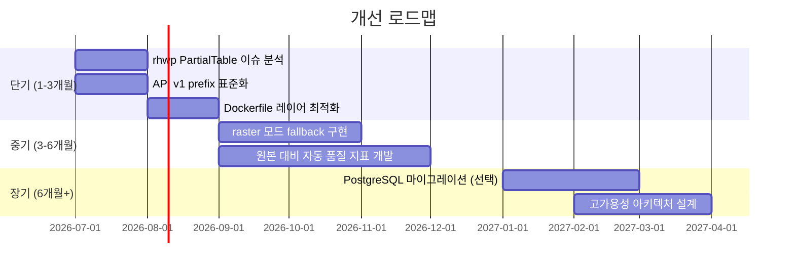

# 유지보수 계획서 (Maintenance Plan)

> Mass Doc to PDF 서비스의 정기 작업, SLA, 버전 관리, 기술 부채 및 개선 로드맵을 정의한다.

| 항목 | 내용 |
| --- | --- |
| **프로젝트명** | Mass Doc to PDF (mass-doc-to-pdf) |
| **문서 버전** | v1.0 |
| **작성일** | 2026-06-11 |
| **최종 수정일** | 2026-06-11 |
| **작성자** | 개발팀 |
| **문서 상태** | 확정 |

---

## 1. 정기 작업

### 1.1 일간 작업

| 작업 | 방법 | 기준 |
| --- | --- | --- |
| 헬스체크 확인 | `curl /health` → `{"status":"ok"}` 확인 | 응답 없음 시 즉각 대응 |
| 오류 로그 확인 | `docker compose logs api \| grep -i error` | ERROR 신규 발생 시 원인 파악 |
| Stuck-running 작업 확인 | `/api/stats` running 값 점검 | 10분 이상 지속 시 reaper 트리거 확인 |
| 큐 처리율 확인 | stats.success / stats.total | 성공률 95% 미만 시 원인 조사 |

```bash
# 일간 점검 스크립트
#!/bin/bash
echo "=== $(date) Health Check ==="
curl -s http://localhost:8010/health | jq .
echo ""
echo "=== Stats ==="
curl -s http://localhost:8010/api/stats | jq .
echo ""
echo "=== Recent Errors ==="
docker compose logs --since=24h api 2>/dev/null | grep -i "error\|fatal" | tail -20
# Standalone:
# journalctl -u hwptopdf-api --since="24 hours ago" -p err --no-pager | tail -20
```

### 1.2 주간 작업

| 작업 | 방법 | 기준 |
| --- | --- | --- |
| DB 백업 | SQLite `.backup` 명령 실행 | 백업 파일 생성 확인 |
| 스토리지 용량 확인 | `du -sh ./data/objects/` | 디스크 70% 이상 시 정리 계획 수립 |
| 성공률 확인 | 주간 stats 집계 | 성공률 주간 95% 이상 목표 |
| 로그 아카이브 | 7일 이상 로그 압축 또는 삭제 | 디스크 여유 확보 |
| 보안 패치 확인 | `npm audit` 실행 | 고위험 취약점 즉시 패치 |

```bash
# 주간 점검 스크립트
#!/bin/bash
echo "=== Weekly Maintenance: $(date) ==="

# DB 백업
sqlite3 ./data/app.db ".backup './data/backups/app.db.$(date +%Y%m%d)'"
echo "DB backup: OK"

# 스토리지 용량
echo "Storage:"
du -sh ./data/objects/ ./data/

# 보안 감사
cd /opt/hwptopdf && npm audit --audit-level=high
```

### 1.3 월간 작업

| 작업 | 방법 | 기준 |
| --- | --- | --- |
| 의존성 업데이트 | `npm outdated`, `npm update` | SEMVER 마이너/패치 업데이트 적용 |
| HWP 엔진 버전 확인 | rhwp 릴리스 노트 확인 | 신규 버전 스테이징 테스트 후 적용 |
| LibreOffice 버전 확인 | `libreoffice --version` | LTS 버전 유지 |
| 코퍼스 품질 테스트 | `npm run test:corpus` 실행 | 4/5 이상 통과 목표 |
| 성능 지표 리뷰 | 월간 응답 시간 / 성공률 집계 | SLA 대비 달성률 검토 |
| 스토리지 오래된 파일 정리 | 30일 이상 파일 삭제 정책 적용 | DB 레코드와 동기화 확인 |

---

## 2. SLA (서비스 수준 목표)

### 2.1 가용성 목표

| 등급 | 목표 가용성 | 허용 월간 다운타임 | 비고 |
| --- | --- | --- | --- |
| 운영 (소규모) | 99.0% | 7시간 18분 | 단일 서버 |
| 운영 (표준) | 99.5% | 3시간 36분 | 권장 목표 |
| 운영 (고가용성) | 99.9% | 43분 | 이중화 필요 |

> 현재 아키텍처(단일 서버)에서는 99.5% 목표 적용. 고가용성이 필요한 경우 DB 복제 및 로드밸런서 구성 검토.

### 2.2 응답 시간 목표

| 엔드포인트 | p50 목표 | p95 목표 | 측정 방법 |
| --- | --- | --- | --- |
| `GET /health` | < 10ms | < 50ms | 모니터링 주기 30초 |
| `POST /api/jobs` (업로드) | < 500ms | < 2s | 파일 크기 의존 |
| `GET /api/jobs/:id` | < 50ms | < 200ms | DB 조회 |
| HWP 변환 (1MB) | < 10s | < 30s | 파일 복잡도 의존 |
| Office 변환 (1MB) | < 5s | < 20s | 파일 복잡도 의존 |

### 2.3 품질 목표

| 지표 | 목표값 | 현재 상태 |
| --- | --- | --- |
| 변환 성공률 | 95% 이상 | 코퍼스 기준 4/5 (80%) — 이슈 문서화 완료 |
| PDF 페이지 수 일치율 | 90% 이상 | rhwp PartialTable 이슈 영향 |

---

## 3. 버전 관리

### 3.1 rhwp 업데이트 추적

```bash
# 현재 버전 확인
pip show rhwp 2>/dev/null || pip3 show rhwp

# 최신 버전 확인
pip index versions rhwp 2>/dev/null

# 업데이트 절차
# 1. 스테이징 환경에서 먼저 적용
pip install --upgrade rhwp

# 2. 코퍼스 품질 테스트 실행
npm run test:corpus

# 3. 통과 시 운영 적용
```

### 3.2 Prisma 마이그레이션 관리

```bash
# 마이그레이션 상태 확인
npx prisma migrate status

# 신규 마이그레이션 생성 (개발)
npx prisma migrate dev --name <migration_name>

# 운영 배포
npx prisma migrate deploy

# 마이그레이션 기록 확인
ls prisma/migrations/
```

### 3.3 주요 의존성 버전 관리

| 패키지 | 현재 정책 | 업데이트 주기 |
| --- | --- | --- |
| `@fastify/core` | SEMVER 마이너 업데이트 허용 | 월간 |
| `prisma` | 마이너 업데이트. 메이저는 마이그레이션 테스트 후 | 분기 |
| `vite` / React | 마이너 업데이트 허용 | 월간 |
| `rhwp` | 스테이징 테스트 후 운영 적용 | 릴리스마다 |
| LibreOffice | LTS 버전 유지 | 연간 |
| Node.js | LTS 버전 유지 (현재 20 LTS) | LTS 주기 |

### 3.4 변경 관리 정책

1. 패치 업데이트: 즉시 적용 (보안 패치)
2. 마이너 업데이트: 스테이징 검증 후 운영 적용
3. 메이저 업데이트: 전체 회귀 테스트 후 적용
4. HWP 엔진 변경: 코퍼스 품질 테스트 통과 필수

---

## 4. 비용 관리

### 4.1 스토리지 비용

| 항목 | Docker (MinIO) | Standalone |
| --- | --- | --- |
| 스토리지 유형 | 로컬 볼륨 또는 S3 | 로컬 파일시스템 |
| 비용 구조 | 서버 디스크 용량 | 서버 디스크 용량 |
| 관리 방법 | 라이프사이클 정책 (30일 만료) | find + cron 삭제 스크립트 |

```bash
# 스토리지 사용량 추세 (주간 기록 권장)
echo "$(date +%Y-%m-%d) $(du -sb ./data/objects/ | cut -f1)" >> storage-trend.log
```

### 4.2 HWP/Office 라이선스

| 항목 | 설명 | 비용 유형 |
| --- | --- | --- |
| rhwp | 오픈소스 (BSD) | 무료 |
| LibreOffice | 오픈소스 (MPL) | 무료 |
| Gotenberg | 오픈소스 (MIT) | 무료 |
| H2Orestart (HWP 사이드카) | 공개 라이선스 확인 필요 | 확인 필요 |
| Hancom HWP 라이선스 | `.hwpx` 공개 포맷 사용 | 무료 (OOXML 기반) |
| Aspose (미사용) | 상용 대안 | 유료 (필요 시 검토) |

### 4.3 서버 비용 절감 팁

- Worker 수를 트래픽에 맞게 조절 (유휴 CPU 낭비 방지)
- 변환 결과 30일 TTL 정책으로 스토리지 비용 통제
- LibreOffice 인스턴스 재사용 (H2Orestart) 로 CPU/메모리 절감

---

## 5. 기술 부채 및 개선 로드맵

### 5.1 현재 기술 부채

| 항목 | 심각도 | 설명 | 예상 해결 시점 |
| --- | --- | --- | --- |
| rhwp PartialTable 이슈 | 중간 | 복잡한 HWP 표 레이아웃에서 셀 병합 누락 발생 | rhwp 상류 기여 또는 우회 |
| 코퍼스 성공률 80% (4/5) | 중간 | 5번 문서 변환 실패. 이슈 문서화 완료 | 엔진 개선 또는 실패 문서 분류 |
| API 버전 비공식 (v1 미표준) | 낮음 | `/api/v1/` prefix 없음. Breaking Change 시 대응 필요 | 다음 마이너 릴리스 |
| 단일 SQLite (스케일 한계) | 낮음 | 동시 쓰기 병목. WAL로 완화. 수백 TPS 이상 시 문제 | 트래픽 증가 시 PostgreSQL 마이그레이션 |
| 이미지 빌드 캐시 미최적화 | 낮음 | `npm ci`가 매 빌드마다 재실행 | Dockerfile 레이어 최적화 |

### 5.2 개선 로드맵



### 5.3 rhwp PartialTable 이슈 상세

**문제:** HWP 파일의 복잡한 표(셀 병합, 중첩 표)에서 PDF 변환 시 레이아웃 손실

**현재 우회:** 
- sidecar(LibreOffice) 폴백으로 처리
- 실패 시 품질 리포트에 `partialTable` 경고 표시

**개선 방향:**
1. rhwp 프로젝트에 이슈 리포트 및 PR 기여 검토
2. 표 복잡도 사전 탐지 → raster 모드(이미지 PDF) 자동 선택

### 5.4 원본 대비 자동 품질 지표 개발

**목표:** 변환된 PDF의 품질을 원본 HWP와 자동으로 비교하는 시스템

**접근 방법:**
- 페이지 수 일치 (현재 구현됨)
- 텍스트 커버리지: pdftotext 추출 후 원본 텍스트와 비교
- 이미지 유사도: 페이지 렌더링 후 SSIM 점수 측정
- 표 감지: PDF 구조 분석으로 표 개수 비교

---

## 변경 이력

| 버전 | 날짜 | 변경 내용 | 작성자 |
| --- | --- | --- | --- |
| v1.0 | 2026-06-11 | 초기 작성 | 개발팀 |
