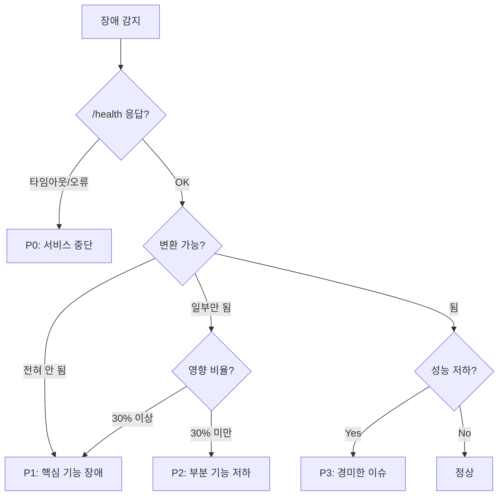
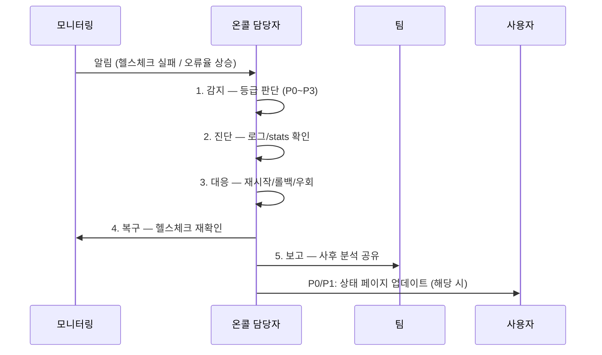

# 장애 대응 런북 (Incident Response Runbook)

> Mass Doc to PDF 서비스의 장애 등급 정의, 대응 절차, 주요 시나리오별 처리 방법을 정의한다.

| 항목 | 내용 |
| --- | --- |
| **프로젝트명** | Mass Doc to PDF (mass-doc-to-pdf) |
| **문서 버전** | v1.0 |
| **작성일** | 2026-06-11 |
| **최종 수정일** | 2026-06-11 |
| **작성자** | 개발팀 |
| **문서 상태** | 확정 |

---

## 1. 장애 등급 정의

| 등급 | 이름 | 설명 | 영향 범위 | 목표 대응 시간 (MTTR) |
| --- | --- | --- | --- | --- |
| **P0** | 서비스 중단 | 전체 서비스 응답 불가. /health 타임아웃 | 전체 사용자 | 30분 이내 |
| **P1** | 핵심 기능 장애 | 변환 불가, 업로드 차단, 인증 불가 | 다수 사용자 | 2시간 이내 |
| **P2** | 부분 기능 저하 | 특정 포맷 변환 실패, 큐 밀림 | 일부 사용자 | 4시간 이내 |
| **P3** | 경미한 이슈 | 성능 저하, 품질 경고 증가 | 소수 사용자 | 영업일 기준 1일 이내 |

### 1.1 등급 판단 기준



---

## 2. 장애 대응 절차

### 2.1 표준 대응 흐름



### 2.2 단계별 세부 절차

**Step 1. 감지**
```bash
# 헬스체크 즉시 확인
curl -s http://localhost:8010/health || echo "SERVICE DOWN"
curl -s http://localhost:8010/api/stats | jq .

# 컨테이너/서비스 상태
docker compose ps                          # Docker
systemctl status hwptopdf-api hwptopdf-worker  # Standalone
```

**Step 2. 진단**
```bash
# 최근 오류 로그 확인
docker compose logs --since=30m api | grep -E "ERROR|FATAL|error"
journalctl -u hwptopdf-api --since="30 minutes ago" -p err --no-pager

# DB 연결 상태
sqlite3 ./data/app.db "SELECT COUNT(*) FROM Job WHERE status='running';"

# 디스크 여유 공간
df -h ./data/
```

**Step 3. 대응**
- 재시작 → 헬스체크 재확인 → 해결 시 Step 4
- 미해결 시 해당 시나리오 섹션(3장) 참조

**Step 4. 복구 확인**
```bash
# 헬스체크
curl -s http://localhost:8010/health | jq .

# 통계 정상화 확인
curl -s http://localhost:8010/api/stats | jq .

# 변환 기능 스모크 테스트
./standalone/scripts/smoke-test.sh  # Standalone
```

**Step 5. 사후 보고**

| 항목 | 내용 |
| --- | --- |
| 발생 일시 | |
| 등급 | P0 / P1 / P2 / P3 |
| 감지 방법 | 모니터링 알림 / 사용자 제보 |
| 영향 범위 | 영향받은 사용자 수, 기간 |
| 근본 원인 | |
| 즉각 조치 | |
| 재발 방지 | |

---

## 3. 주요 장애 시나리오별 대응

### 3.1 API 서버 다운 (P0)

**증상:**
- `/health` 타임아웃 또는 connection refused
- 전체 서비스 접근 불가

**진단:**
```bash
# Docker
docker compose ps api
docker compose logs api --tail=100

# Standalone
systemctl status hwptopdf-api
journalctl -u hwptopdf-api -n 100 --no-pager
```

**대응:**
```bash
# 1단계: 재시작 시도
docker compose restart api          # Docker
sudo systemctl restart hwptopdf-api # Standalone

# 2단계: 재시작 후 확인 (30초 대기)
sleep 30 && curl -s http://localhost:8010/health

# 3단계: 재시작 실패 시 — DB 확인
sqlite3 ./data/app.db ".tables"
ls -la ./data/app.db

# 4단계: 스토리지 확인
ls -la ./data/objects/ 2>/dev/null || echo "Storage missing"

# 5단계: 여전히 실패 시 — 롤백
# deployment-plan.md 섹션 6 참조
```

**P0 → 해제 기준:** `/health` → `{"status":"ok"}` + stats 응답 정상

---

### 3.2 Worker 정지 (큐 밀림, P1)

**증상:**
- `/api/stats` running 값이 증가하고 성공/실패가 처리되지 않음
- 작업이 `pending` 상태에서 진행되지 않음

**진단:**
```bash
# Worker 상태
docker compose ps worker
systemctl status hwptopdf-worker

# 큐 상태 직접 확인
sqlite3 ./data/app.db "
  SELECT status, COUNT(*) as cnt FROM Job GROUP BY status;
"

# Stuck running 작업
sqlite3 ./data/app.db "
  SELECT id, status, lockedAt
  FROM Job
  WHERE status='running' AND lockedAt < datetime('now', '-10 minutes');
"
```

**대응:**
```bash
# 1단계: Worker 재시작
docker compose restart worker
sudo systemctl restart hwptopdf-worker

# 2단계: Reaper 자동 동작 대기 (10분)
# 또는 수동 초기화
sqlite3 ./data/app.db "
  UPDATE Job
  SET status='pending', lockedAt=NULL
  WHERE status='running'
    AND lockedAt < datetime('now', '-10 minutes');
"

# 3단계: Worker 로그 확인
docker compose logs worker --tail=100
journalctl -u hwptopdf-worker -n 100 --no-pager

# 4단계: OOM 여부 확인
dmesg | grep -i "oom\|kill" | tail -20
```

**P1 → 해제 기준:** stats.running 감소 + pending 작업 처리 재개

---

### 3.3 HWP Sidecar 연결 오류 (P2)

**증상:**
- HWP 파일 변환 일제 실패
- 로그: `connect ECONNREFUSED hwp-sidecar:8080` 또는 `127.0.0.1:18080`
- Office 파일 변환은 정상

**진단:**
```bash
# Docker
docker compose ps hwp-sidecar
docker compose logs hwp-sidecar --tail=50

# 포트 확인
curl -s http://localhost:18080/health 2>/dev/null || echo "Sidecar down"
```

**대응:**
```bash
# 1단계: Sidecar 재시작
docker compose restart hwp-sidecar

# 2단계: LibreOffice 프로세스 확인
docker compose exec hwp-sidecar ps aux | grep soffice

# 3단계: Sidecar 재시작 실패 시 — 임시 체인 우회
# .env에서 HWP_SIDECAR_URL 비워서 체인 제외
# -> rhwp 또는 builtin 엔진만 사용
echo "HWP_SIDECAR_URL=" >> .env
docker compose restart api worker

# 4단계: HWP 작업 재시도 처리
sqlite3 ./data/app.db "
  UPDATE Job
  SET status='pending', lockedAt=NULL, attempts=attempts-1
  WHERE status='failed'
    AND engine LIKE '%hwp%'
    AND updatedAt > datetime('now', '-1 hour');
"
```

**P2 → 해제 기준:** HWP 변환 성공 재확인

---

### 3.4 S3/MinIO 연결 오류 (P1)

**증상:**
- 파일 업로드 실패 (`500 Internal Server Error`)
- 로그: `S3 error`, `NoSuchBucket`, `connection refused` (minio:9000)

**진단:**
```bash
# MinIO 상태
docker compose ps minio
docker compose logs minio --tail=50

# 접속 테스트
curl -s http://localhost:9000/minio/health/live
curl -s http://localhost:9001   # MinIO 콘솔
```

**대응:**
```bash
# 1단계: MinIO 재시작
docker compose restart minio

# 2단계: 재시작 후 대기 (MinIO 초기화 시간)
sleep 15 && curl -s http://localhost:9000/minio/health/live

# 3단계: 버킷 존재 확인
docker compose exec minio mc ls minio/

# 4단계: 버킷 없을 경우 재생성
docker compose exec minio mc mb minio/hwptopdf

# 5단계: 자격증명 확인 (.env의 S3_ACCESS_KEY, S3_SECRET_KEY)
docker compose exec api env | grep S3_

# Standalone: 로컬 파일 스토리지 권한 확인
ls -la ./data/objects/
chown -R $USER:$USER ./data/objects/
```

**P1 → 해제 기준:** 파일 업로드 성공 + 변환 완료 확인

---

### 3.5 Rate Limit 폭발 (P2/P3)

**증상:**
- 다수 사용자에게 HTTP 429 Too Many Requests
- API 응답 시간 정상이나 요청 차단됨

**진단:**
```bash
# 로그에서 429 발생 빈도 확인
docker compose logs api --since=1h | grep "429\|rate.limit\|Too Many" | wc -l

# 특정 IP 과부하 여부
docker compose logs api --since=1h | grep "429" | awk '{print $NF}' | sort | uniq -c | sort -rn | head -10
```

**대응:**
```bash
# 1단계: 공격/자동화 스크립트 여부 판단
# 단일 IP에서 대량 요청 → 차단
# 정상 트래픽 증가 → 한도 상향

# 2단계-A: 공격 IP 차단 (Standalone, nginx)
echo "deny <공격_IP>;" | sudo tee -a /etc/nginx/conf.d/block.conf
sudo nginx -t && sudo nginx -s reload

# 2단계-B: 한도 상향 (.env 수정 후 재시작)
# RATE_LIMIT_MAX=600
# AUTH_RATE_LIMIT_MAX=120
docker compose restart api
sudo systemctl restart hwptopdf-api
```

**P2 → 해제 기준:** 429 응답율 5% 미만으로 감소

---

## 4. 롤백 기준

| 상황 | 롤백 여부 | 롤백 방법 |
| --- | --- | --- |
| 배포 후 /health 실패 지속 | 즉시 롤백 | 이전 이미지/tarball 복원 |
| 배포 후 변환 성공률 80% 미만 | 30분 관찰 후 롤백 | 이전 버전 복원 |
| 보안 취약점 발견 | 즉시 롤백 + 패치 | 패치 배포 전까지 서비스 차단 고려 |
| DB 마이그레이션 실패 | 즉시 롤백 | 백업에서 DB 복원 후 이전 코드 배포 |
| 성능 20% 이상 저하 | 1시간 관찰 후 결정 | 관찰 후 롤백 또는 핫픽스 |

### 4.1 롤백 절차 (상세)

`deployment-plan.md` 섹션 6 참조.

빠른 참조:
```bash
# Docker: 즉각 재시작
docker compose restart api worker

# Docker: 버전 롤백
docker compose down
# docker-compose.yml 이전 태그로 수정
docker compose up -d

# Standalone: 재시작
sudo systemctl restart hwptopdf-api hwptopdf-worker

# DB 복원 (필요 시)
sudo systemctl stop hwptopdf-api hwptopdf-worker
cp ./data/app.db.backup-<날짜> ./data/app.db
sudo systemctl start hwptopdf-api hwptopdf-worker
```

---

## 5. 에스컬레이션 연락처

> **주의:** 실제 배포 시 아래 placeholder를 실제 연락처로 교체하라.

| 역할 | 이름 | 연락처 | 담당 |
| --- | --- | --- | --- |
| 온콜 1차 담당 | (담당자 이름) | (이메일 / 전화) | P0~P2 1차 대응 |
| 온콜 2차 담당 | (담당자 이름) | (이메일 / 전화) | 1차 30분 미해결 시 |
| 인프라 담당 | (담당자 이름) | (이메일 / 전화) | 서버, 네트워크, 스토리지 |
| 보안 담당 | (담당자 이름) | (이메일 / 전화) | 보안 사고, 시크릿 유출 |
| 서비스 책임자 | (담당자 이름) | (이메일 / 전화) | P0 발생 시 즉시 보고 |

### 5.1 에스컬레이션 기준

| 상황 | 에스컬레이션 대상 |
| --- | --- |
| P0 발생 즉시 | 온콜 1차 + 서비스 책임자 |
| P0 30분 미해결 | 온콜 2차 추가 |
| 보안 사고 (시크릿 유출, 무단 접근) | 보안 담당 즉시 |
| 인프라 장애 (서버 다운, 디스크 풀) | 인프라 담당 |
| P1 2시간 미해결 | 온콜 2차 + 서비스 책임자 |

---

## 변경 이력

| 버전 | 날짜 | 변경 내용 | 작성자 |
| --- | --- | --- | --- |
| v1.0 | 2026-06-11 | 초기 작성 | 개발팀 |
